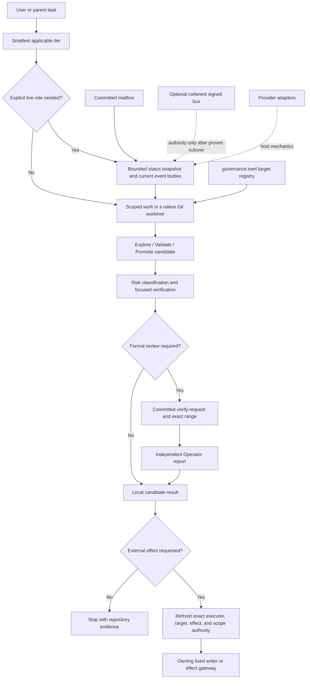

# Pipeline repository manual

> Descriptive map, not an authority source. This manual explains what is in the
> repository and how the pieces connect. `AGENTS.md` routes current work,
> `ARCHITECTURE.md` records verified system facts, and executable code wins when
> prose drifts. User authority, review authority, and external-effect authority
> are not created by this document.

## 1. Identity and intent

Pipeline is a small governance kernel around AI-assisted engineering. It is not
the product being built, an agent scheduler, an AI provider, or a general CI
platform. Its purpose is to keep the minimum durable evidence needed to answer:

- What task and repository were in scope?
- Who, if anyone, held an explicitly assigned role?
- What exact Git range was implemented and reviewed?
- What evidence supports the result?
- Was an external effect separately authorized?

The default registered product target is `evidence-ledger`, but product-local
truth remains in the target repository. Pipeline owns provider-neutral identity,
review, mailbox, target-binding, and optional signed-control-plane mechanics.

The normal path is deliberately smaller than the repository's historical
four-seat vocabulary suggests. A read-only question may need no repository
orientation. Ordinary reversible local work needs a native Git worktree and
focused checks, not a seat ceremony. Formal Director/Operator artifacts appear
only when the actual risk or transfer boundary requires them. Push, merge, lock,
cursor consumption, provider launch, spend, and live-data mutation are separate
effects even after review succeeds.

Three independent classifications shape a run:

| Question | Closed decision surface | Effect |
|---|---|---|
| How much repository context is needed? | `AGENTS.md` tier 0 through tier 3 | Controls orientation depth. |
| What phase is the product work in? | `explore`, `validate`, `promote` in `docs/protocol/work-modes.md` | Controls iteration and candidate freezing. |
| How risky is the change or claim? | `ordinary-local`, `material-behavior`, `high-risk-control`, `external-effect` in `scripts/codex_protocol_model.py` | Controls evidence, independence, and authority requirements. |

Work mode never grants a role or an effect. A role never grants an external
effect. A passing test proves only the path it executed.

## 2. Audit scope and method

This manual was prepared during the repository-wide audit on branch
`codex/repository-audit-2026-08-09`, against base commit
`89b212b3d3c152a70c3caba9afb5694c9dda6e3a`. Candidate changes are described
where relevant, but they remain a candidate until the repository's review and
promotion rules are satisfied.

The inventory was driven by Git rather than filesystem discovery:

```bash
git rev-parse --show-toplevel
git rev-parse HEAD
git ls-files
git status --short --branch
```

That distinction matters. Large parts of `coordination/` are ignored for new
runtime files but contain intentionally tracked historical evidence. `rg
--files` or a plain `find` therefore does not describe the committed repository
faithfully.

### 2.1 Base census

At the audited base, `git ls-files` returned 1,603 paths, approximately 11.55 MB
and 211,302 text lines. The dominant file classes were:

| Extension | Count | Principal use |
|---|---:|---|
| `.md` | 1,109 | Active doctrine, mailbox events, handoffs, plans, and evidence. |
| `.json` | 281 | Capacity packets, verification scopes, logs, and tests. |
| `.py` | 159 | Runtime, signed plane, and pytest contracts. |
| `.toml` | 14 | Project, target, agent, and provider configuration. |
| `.txt` | 10 | Locked dependencies, registries, cursor compatibility state, and allowlists. |
| `.sh` | 2 | Signed-plane cutover and merge-gate launch. |
| `.in` | 2 | Direct dependency inputs. |
| `.jsonl` | 2 | Append-only claim and learning logs. |

Top-level distribution at the same base:

| Path | Tracked files | What dominates the count |
|---|---:|---|
| `coordination/` | 1,083 | 886 sent events and 158 capacity packets. |
| `docs/` | 165 | Active protocol docs, 93 historical Superpowers artifacts, and handoffs. |
| `logs/` | 107 | Capability experiments and acceptance evidence. |
| `tests/` | 78 | Unit, integration, and learning-pack contracts. |
| `scripts/` | 68 | Executables plus four baseline data files. |
| `.claude/` | 24 | Claude discovery/adaptation surfaces at the base. |
| `threeway/` | 20 | Signed event-plane package. |
| `.agents/` | 14 | Canonical reusable skills. |
| `.codex/` | 9 | Codex agent definitions and configuration. |
| `.github/` | 2 | CI and pull-request template. |
| `.superpowers/` | 2 | Retained historical reports, not live instructions. |
| Root files | 17 | Routers, truth/intent docs, dependencies, and configuration. |

The candidate removes retired Claude hookify files, a duplicated Claude
`seat_status.py`, and the always-successful duplicate
`scripts/system_health_check.py`; it also adds focused regression modules. Counts in
this section intentionally remain bound to the stated base instead of silently
changing with the worktree.

### 2.2 Structural checks

Every tracked Python source was parsed with `ast.parse`; every tracked JSON,
JSONL, and TOML file was parsed with its corresponding parser; and every tracked
shell entrypoint was checked with `bash -n`. The base scan found zero syntax or
data-format errors. This establishes structural readability, not semantic
correctness.

The base full test run was:

```text
PYTHONDONTWRITEBYTECODE=1 env -u GIT_INDEX_FILE .venv/bin/python \
  -m pytest -q -p no:cacheprovider

2 failed, 1737 passed
```

The failures included an integration test that still expected an older ChatGPT
Pro reservation contract. `scripts/governance_verify_all.py` is a separate
invariant bundle and did not run the full suite; the workflow's pytest job
covered only `tests/unit` at the base. The candidate repairs the integration
drift and makes that job run the complete `tests` tree.

Frozen candidate verification completed with `1,889 passed in 174.69s`.
`scripts/governance_verify_all.py` returned zero with no fatal findings and six explicitly
grandfathered immutable-history advisories. The focused high-risk slice added
`356 passed`; structural parsing, shell syntax, relative documentation targets,
and diff whitespace were also clean.

### 2.3 Audit limits

The scan accounts for every tracked path by class and validates every
machine-readable file, but it does not reinterpret each of the 886 historical
event bodies or 93 historical Superpowers artifacts as current policy. Their
immutability and parseability were checked; their original claims remain
historical evidence.

No provider was launched, no mailbox cursor was consumed, no lock was claimed,
and nothing was pushed or merged for this descriptive audit. Local tests cannot
prove live GitHub branch protection, remote ref policy, a provider's actual
identity, or production signing-key custody. Those require environment-of-record
evidence and exact authority.

## 3. Truth and authority hierarchy

Use the narrowest source that owns the question:

| Need | Source of truth | Important boundary |
|---|---|---|
| Current user intent and effect permission | Current user or accepted parent task | Never inferred from role, schema, or old event. |
| Repository routing and task tier | `AGENTS.md` | Router, not duplicated doctrine. |
| Current verified system facts | `ARCHITECTURE.md`, checked against code | Executable behavior wins if prose drifts. |
| User-principal product intent | `docs/PROGRAM-MANUAL.md` | Intent, not runtime implementation. |
| Work phase | `docs/protocol/work-modes.md` plus `work_profile_for` | Phase is independent of risk and authority. |
| Runtime identity, ownership, review risk, effect shape | `scripts/codex_protocol_model.py` | Closed executable policy seam. |
| Formal request/report grammar and exact range | `scripts/compact_pair_loop.py` | A committed binding; authors cannot self-approve. |
| Current governed task state | Current committed route/event bodies and Git state | Newer concrete evidence outranks handoffs and packets. |
| Mailbox publication or cursor mutation | `scripts/mailbox_writer.py` through fixed wrappers | Editing, staging, committing, and consuming are separate. |
| Signed-bus state | `refs/threeway/*` only when the event ref and addressed cursor ref are both coherent | Partial or absent bus must not become an empty queue. |
| Provider mechanics | Provider continuation and native adapter | Provider surfaces may adapt mechanics, not policy. |
| Product behavior | Selected target repository | Pipeline does not own product-local truth. |
| Historical rationale | `DECISIONS.md`, handoffs, packets, logs, transfer docs, and review artifacts | Evidence and provenance, not automatically active instructions. |

## 4. System topology



The mailbox and signed plane are not two equal mutable truths. The mailbox is
the operational fallback until the complete signed event/cursor authority pair
is proven. Provider launchers and UI hooks are adapters around the same policy;
they do not become independent governance kernels.

## 5. Repository map

### 5.1 Root files

| Path | Purpose |
|---|---|
| `AGENTS.md` | Agent-neutral router, tier selection, engineering discipline, review policy, and effect boundaries. |
| `CLAUDE.md` | Claude-specific router into the same protocol. |
| `README.md` | Purpose, quick start, document map, and verification entrypoints. |
| `ARCHITECTURE.md` | Current verified topology and runtime invariants. |
| `docs/PROGRAM-MANUAL.md` | Canonical expression of user-principal intent. |
| `OPERATIONS.md` | Operator commands and troubleshooting. |
| `RUNBOOK-DAILY.md` | Compact recurring operating sequence; subordinate to current code and routes. |
| `DECISIONS.md` | Append-only architectural decision history. Supersede by adding, not rewriting old decisions. |
| `TRANSFER-MANIFEST.md`, `TRANSFER-SETUP.md` | Historical bundle-generation provenance; not a current setup path. |
| `governance.toml` | Declarative kernel and target registry; default target and forbidden roots. |
| `pyproject.toml` | Package metadata, Python floor (`>=3.11`), pytest paths, and warning policy. |
| `requirements-governance.in` | Direct runtime dependencies: `cryptography` and `rfc8785`. |
| `requirements-dev.in` | Governance dependencies plus `pytest` and `hypothesis`. |
| `requirements-governance.txt`, `requirements-dev.txt` | Hash-locked transitive dependency sets generated by `pip-compile`. |
| `.env.example` | Optional external-runner variables only. It excludes role/runtime identity, secrets, and `GIT_INDEX_FILE`; provider launchers own their supported runtime facts. |
| `.gitignore` | Runtime, secret, cache, worktree, learning-index, and provider-local exclusions. Tracked ignored history still exists in Git. |

### 5.2 Hidden provider and host surfaces

| Path | Contents and role |
|---|---|
| `.agents/skills/` | Canonical reusable skills: four-seat routing, role deltas, claim/control probes, regression pins, wave gate, variable isolation, consultation, and domain-specific Kurogane guidance. Skill presence grants no role. |
| `.codex/agents/` | Codex custom-agent definitions for readiness, formal roles, and read-only reviewers; `.codex/config.toml` registers project behavior. |
| `.claude/skills/`, `.claude/agents/` | Claude discovery/adaptation layers and read-only advisor definitions. The candidate removes obsolete repository hookify files and the duplicate seat-status implementation. |
| `.github/workflows/ci.yml` | Smoke, full pytest matrix, risk-aware admission, and separately gated signed `ci_result` workflow. |
| `.github/pull_request_template.md` | Review/evidence prompts for pull requests. |
| `.superpowers/sdd/` | Two retained historical reports. Pipeline does not depend on the Superpowers plugin. |

### 5.3 Runtime, documentation, evidence, and tests

| Path | Contents and lifecycle |
|---|---|
| `scripts/` | 63 current top-level executables/data helpers in the candidate, grouped in section 6. Three JSON baselines feed current checks; `lane_v_report_v1.json` is retained but has no current reader. |
| `coordination/README.md`, `coordination/mailbox/kinds.txt` | Coordination layout/authority orientation and the fixed writer's accepted event-kind registry. The kind registry is load-bearing data. |
| `threeway/` | 20-module signed event/ref-bus package, grouped in section 7. |
| `coordination/bin/` | Six fixed shell front doors for Codex launch, mailbox, locks, and claim probing. |
| `coordination/mailbox/sent/` | 886 committed Markdown event bodies at the base. Append-only operational/history corpus. |
| `coordination/mailbox/seen/` | Six tracked compatibility files at the base. Current active cursor ownership is only the four pair seats; coordinator files remain migration/history compatibility state and do not grant a coordinator a cursor. |
| `coordination/mailbox/archive/` | Archived mailbox index/state. |
| `coordination/capacity/packets/` | 158 JSON campaign/capacity packets. Diagnostic evidence, never task or effect authority. |
| `coordination/locks/` | Ephemeral Git-native shared-module locks; empty in the committed base except for its sentinel. |
| `coordination/presence/` | Legacy/provider liveness guidance and templates. Host activity is authoritative for Codex liveness. |
| `coordination/threeway/` | Public-key layout and local event sentinel. Private keys are intended to be off-repo; bootstrap enforces separation from the public registry, while the caller remains responsible for choosing an actually off-repo keystore. |
| `coordination/verification/` | One authority record and eleven historical verification-scope records. |
| `coordination/workflows/discovery-bughunt.js` | Reusable historical discovery-bughunt workflow description, not a core Python runtime. |
| `docs/protocol/agents/` | Universal role, orchestration, and failure doctrine. |
| `docs/protocol/app-quickstart.md` | Desktop-first setup, native capability comparison, and same-app versus durable cross-app communication. |
| `docs/protocol/{codex,claude}/` | Host-specific continuation and adoption mechanics. |
| `docs/protocol/threeway/` | Optional signed-plane onboarding, adoption, architecture, mechanism ledger, and a historical Codex review. |
| `docs/protocol/learning/` | Learning-plane contract and one skill-discovery experiment. |
| `docs/templates/` | Implementer/reviewer prompt templates retained for explicit use. |
| `docs/superpowers/` | 93 historical briefs, plans, and specs. Inputs and provenance, not current instructions. |
| `docs/HANDOFF-*.md` | 31 durable historical transfer/closeout records at the base. Current Git and events outrank them. |
| `docs/{INCIDENT-LOG,PROTOCOL-RULES-LOG,REMEDIATION-INVENTORY}.md` | Incident history, rule provenance, and campaign inventory. |
| `logs/capability-first/` | 96 files from a bounded capability experiment, including records and evidence snapshots. |
| `logs/claims/`, `logs/learning/` | Append-only claim and learning ledgers. |
| Remaining `logs/*.json` and `.md` | Acceptance, performance, consultation, and status evidence. Preserve context and date when citing. |
| `tests/unit/` | Fine-grained behavior, negative-control, provider-isolation, document, signed-plane, and property contracts. |
| `tests/integration/` | End-to-end manual consultation reservation/finalization contract. |
| `tests/learning_packs/` | Recurrence fixture for learning-plane tests. |

## 6. Executable inventory: scripts and fixed front doors

This section accounts for every current top-level file in `scripts/` and every
fixed shell front door. Files are grouped by the mechanism they serve; a group
does not imply an authority grant.

### 6.1 Policy, orientation, Git projection, and targets

| File | Responsibility |
|---|---|
| `scripts/codex_protocol_model.py` | Canonical runtime identity, seat outcome, work/review profiles, model-family independence, ownership, and effect-shape policy. |
| `scripts/status.py` | Compact read-only orientation snapshot plus a compatibility dashboard for Git, mailbox/unread authority, request state, ADR, docs, manifest, and optional environment status; only dashboard `--write` writes `STATUS.md`. |
| `scripts/startup_snapshot.py` | Typed Git/mailbox state collectors used by orientation paths. |
| `scripts/continuation_readiness.py` | Compatibility wrapper around the compact orientation snapshot. |
| `scripts/git_commit_projection.py` | Pins one repository identity/HEAD and builds a bounded in-memory commit graph for type and ancestry checks. |
| `scripts/protocol_mailbox.py` | Shared seat/kind vocabulary and parsers for ownership, routes, reviews, learning candidates, and dispositions. |
| `scripts/route_lineage.py` | Resolves route ancestry and supersession from event contents rather than trusting filenames. |
| `scripts/packet_state.py` | Derives packet state from legacy capacity-packet fields without turning packets into authority. |
| `scripts/bus_unread.py` | Chooses coherent signed-bus unread state or truthful mailbox fallback; ambiguity is unavailable, not zero. |
| `scripts/target_binding.py` | Parses `governance.toml`, selects a registered target, expands its local path, and exposes forbidden roots. |
| `scripts/ledger_start_guard.py` | Pipeline-first preflight for an explicitly selected ledger-routed target/seat/wave. |

### 6.2 Mailbox, review, handoff, and claim evidence

| File | Responsibility |
|---|---|
| `scripts/mailbox_writer.py` | Fixed fail-closed event/cursor candidate validation, writer fencing, atomic finalization, and explicit staging. |
| `scripts/compact_pair_loop.py` | Composes/parses committed verify-requests and verification-reports; binds identities, risk, abuse analysis, repository, paths, ancestry, exact range, and supersession. |
| `scripts/check_coordination.py` | Lints committed mailbox/cursor/history state and inspects current verify-request/report closure. |
| `scripts/mailbox_monitor.py` | Read-only one-shot or watch view of unread events, broadcasts, receipt ambiguity, and heartbeat hints. |
| `scripts/draft_handoff.py` | Drafts a handoff from live protocol evidence without publishing it. |
| `scripts/latest_handoff.py` | Selects the newest durable handoff for a concrete seat with path/time validation. |
| `scripts/archive_handoffs.py` | Transactionally stages history-preserving `git mv` archival and a cumulative daily index; it rejects unmatched keep names and symlinked archive targets, and reverses this invocation on failure/interruption. |
| `scripts/check_go_schema.py` | Validates frozen historical report bytes and current compact report structure. |
| `scripts/consume_reviewer_result.py` | Parses `reviewer-result/1`, validates schema, safely reruns cited pytest commands, detects fabrication, and proposes inventory transitions. |
| `scripts/claim_check.py` | Derives claim premises from sentence shape and prepares reduced-context challenge probes. |
| `scripts/chatgpt_pro_consult.py` | Content-free repository-scoped reservation/finalization state for one manual ChatGPT Pro consultation; it stores no prompt or answer. |

### 6.3 Provider adapters

| File | Responsibility |
|---|---|
| `scripts/codex_seat_launcher.py` | Builds one Codex launch spec from per-seat model/tier config, sanitizes inherited state, and rejects forwarded execution-shape overrides. Trusted user/project config still owns effective sandbox/approval posture; the launcher does not attest it. |
| `scripts/harness_preflight.py` | Checks whether the Codex review harness can execute its required path before dispatch; `--live` may launch a provider and incur spend, so it remains separately authorized. |
| `scripts/seat_banner.py` | Renders the explicit objective/permission/scope/verification/done seat contract. |

### 6.4 CI, health, inventory, and anti-ceremony controls

| File | Responsibility |
|---|---|
| `scripts/governance_verify_all.py` | Completion bundle for architecture/doc, coordination, no-ceremony, schema, placeholder, and runtime invariants. |
| `scripts/ci_admission_gate.py` | Classifies a PR range against active authority/skill/config/baseline surfaces and requires structurally valid committed high-risk Compact Pair evidence when triggered. Declared reviewer fields are not runtime identity attestation. |
| `scripts/check_doc_claims.py` | Checks line/symbol anchors, manifests, and optional historical commit-SHA citations; can classify reviewed baseline drift. |
| `scripts/check_arch_freshness.py` | Rejects substantive `ARCHITECTURE.md` changes without a new resolvable verification stamp. |
| `scripts/check_no_ceremony.py` | Runs behavioral and structural controls against verification theater; the candidate makes its wave-gate test execute a real selector. |
| `scripts/check_placeholders.py` | Fail-closed placeholder scan with `scripts/placeholder_allowlist.txt` as the explicit baseline. |
| `scripts/wave_gate_check.py` | Selects a campaign wave's strict-xfail pins, runs them under `--runxfail`, checks product oracles, and reports MET/UNMET; an empty wave is UNMET in the candidate. |
| `scripts/pin_reconciler.py` | Finds inventory rows marked verified whose pins still behave as xfails. |
| `scripts/seed_inventory.py` | Enumerates pytest xfail pins into candidate inventory rows; candidate parse/dynamic-metadata ambiguity fails visibly. |
| `scripts/protocol_doctor.py` | Strict read-only bundle of protocol validation checks. |
| `scripts/protocol_capacity.py` | Computes hard-gated capacity/route state from packets and current evidence. |
| `scripts/protocol_capacity_board.py` | Renders or validates the capacity board. |
| `scripts/status_benchmark.py` | Measures the direct orientation snapshot without converting timing into an authority gate. |
| `scripts/threeway_mechanism_ledger.py` | Ensures every load-bearing signed event kind has a current emitter/support row and only cites tests that exist. |
| `scripts/placeholder_allowlist.txt` | Data input to the placeholder checker, not an executable. |
| `scripts/baselines/*.json` | Three current immutable-history/report compatibility inputs plus the currently unreferenced retained `lane_v_report_v1.json`. |

The candidate deletes `scripts/system_health_check.py`: it duplicated existing
checks and returned success even when it printed failures, so its presence
increased apparent surface without increasing protection.

### 6.5 Learning plane

| File | Responsibility |
|---|---|
| `scripts/learning_index.py` | Builds/queries a local rebuildable index from a pinned committed tree; unavailable remains distinct from zero results. |
| `scripts/learning_extract.py` | Drafts one evidence-triggered learning candidate into scratch; it does not publish or mutate Git. |
| `scripts/learning_metrics.py` | Reports read-only candidate/disposition/promotion lifecycle metrics and advisory linkage warnings. |

### 6.6 Optional signed-plane commands

| File | Responsibility |
|---|---|
| `scripts/overseer_emit.py` | Emits overseer-signed brief, assignment, cycle, release, roster, challenge, supersession, and revocation facts. |
| `scripts/overseer_plan.py` | Converts one chief decision record and effective state into emittable/owed overseer commands; useful only when that operating path is active. |
| `scripts/chief_emit.py` | Emits roster-bound chief human approval or revokes that chief's own prior fact. |
| `scripts/seat_emit.py` | Emits an interactive seat's own signed control-plane fact after authority/state checks. |
| `scripts/sign_ci_result.py` | Emits the CI seat's signed result for an exact integration SHA. |
| `scripts/consume_bus.py` | Reads addressed events and advances only a production/review seat cursor; filtered reads require `--no-advance` in the candidate. |
| `scripts/run_merge_gate.py` | Polls the signed plane, evaluates candidates, and calls the mechanical gate; candidate `--run-once` errors return nonzero. |
| `scripts/run_merge_gate.sh` | Fixed daemon wrapper targeting the protected test ref, never production `main`. |
| `scripts/execute_threeway_cutover.sh` | Explicit double-confirmed key/bootstrap and legacy-to-signed-plane cutover driver. |

### 6.7 Fixed shell front doors

| Path | Delegates to / effect |
|---|---|
| `coordination/bin/codex-seat` | Capability-checks Python and invokes `codex_seat_launcher.py`; provider launch is still separately authorized. |
| `coordination/bin/send-event` | Builds a canonical temporary event in a sanitized environment, invokes Compact Pair validation where required, then delegates final publication/staging to `mailbox_writer.py`. It does not commit. |
| `coordination/bin/consume-events` | Sanitized fixed cursor-writer shim; validates, advances, and stages only the assigned pair seat's cursor. |
| `coordination/bin/claim-lock` | Separately authorized remote Git effect: validates identifiers/holder context, refreshes origin, creates and push-races an ignored lock file. |
| `coordination/bin/release-lock` | Separately authorized holder-bound remote Git effect: validates the record, deletes, commits, and pushes the release. |
| `coordination/bin/probe-claim` | Displays derived premises and launches one reduced-context provider challenge; advisory and separately authorized because it launches/spends. |

## 7. The `threeway` package

The signed plane is a second, optional transport/control substrate. It is not
required for ordinary local work or for the legacy mailbox to function.

| Module | Responsibility |
|---|---|
| `threeway/__init__.py` | Schema constants, event vocabulary, load-bearing kinds, and seat topology constants. |
| `threeway/canon.py` | Single RFC 8785 canonical-byte chokepoint used by signatures and digests. |
| `threeway/envelope.py` | Event data model, payload/idempotency digests, signed view, signing, verification, JSON conversion, and shape validation. |
| `threeway/keys.py` | Ed25519 generation, permission-checked private-key loading, and object-addressed public-key lookup bound to a resolved Git commit; dirty working-tree registry bytes are ignored. |
| `threeway/keys_bootstrap.py` | Transactional exact-roster, no-overwrite public/private key provisioning; complete matching rosters are idempotent, partial/unsafe state fails, and failed invocations remove only the exact inodes they created. |
| `threeway/store.py` | Older local filesystem append-only signed JSON store retained for Slice-1 compatibility/tests. |
| `threeway/refstore.py` | Current Git-ref event store with one commit per event, sequence allocation, idempotency checks, local CAS or remote push-CAS retries, and cursor refs. |
| `threeway/gitcas.py` | Object-store-only merge-tree/commit-tree/update-ref plumbing; it does not check out or execute candidate code. |
| `threeway/reducer.py` | Replays verified facts into effective state and applies authority/latest/revocation semantics. |
| `threeway/approval_authority.py` | Resolves candidate context, signer seats, rostered approvers, mirror co-signers, and re-verification authority. |
| `threeway/policy.py` | Ordered path-to-risk-tier rules and accepted policy digest. |
| `threeway/tier.py` | Computes effective risk as the maximum of assigned and diff-classified tier. |
| `threeway/predicate.py` | Evaluates effective state and Git diff as MERGEABLE, PENDING, or REJECTED. |
| `threeway/gate.py` | Verifies every load-bearing signature/bus/signer, reduces state, evaluates the predicate, and performs exact-SHA test-ref merge completion. It never executes candidate code. |
| `threeway/loop.py` | Builds unsigned tactical-loop event candidates for the two provider pairs; callers sign and append. |
| `threeway/rework.py` | Counts only authoritatively aborted candidates per brief version and escalates beyond the rework cap. |
| `threeway/legacy_projector.py` | Read-only projection of legacy mailbox files into non-load-bearing carrier events in a reproducible total order. |
| `threeway/cursor_backfill.py` | Converts historical ISO cursor files to scalar sequence state with a reversible manifest. Six legacy names are migration compatibility, not current coordinator cursor authority. |
| `threeway/divergence.py` | Read-only comparison of projected carrier-event set/cursors against the live legacy mailbox. |
| `threeway/cutover.py` | Preflights, journals actual predecessor/new OIDs for successful CAS writes, appends projected events, and backfills cursors. Coherent refs are the local authority flip (`activated=True`); rollback refuses interleaving instead of overwriting it. |

### 7.1 Signed-plane flow

1. `keys_bootstrap` creates the exact public/private roster. Public keys must be
   committed before cutover; private seeds belong in a caller-selected off-repo
   mode-`0700` directory as
   mode-`0600` regular files. A failed bootstrap removes only matching files
   created by that invocation, so a retry does not inherit a stranded roster.
2. `legacy_projector` and `cursor_backfill` deterministically model existing
   mailbox state.
3. `cutover` records each successful CAS's actual predecessor/new OIDs, appends
   the projection, advances compatibility cursors, and restores only one
   contiguous chain owned by this run through CAS on
   failure. Cursor backfill separately restores its exact pre-call files and
   manifest when a filesystem write fails or the process is interrupted. Because readers consult no
   separate marker, an authorized successful cutover is the local authority flip.
4. An emitter builds an event; `canon` and `envelope` produce deterministic
   signed bytes; `refstore` allocates sequence and appends through CAS.
5. `gate.verify_and_reduce` validates the trust root, signature profile, bus,
   sender, and event shape before `reducer` forms effective state.
6. `predicate` recomputes tier and checks exact candidate/approval/CI/release
   conditions.
7. Only a MERGEABLE result lets `gitcas` advance the configured protected test
   ref and emit `merge_completed`.

The implementation's default merge target is `refs/threeway/test-main`, not
`refs/heads/main`. Production activation therefore remains unproved until the
real remote, protection rules, keys, credentials, and rollback path are
verified in their environment of record.

## 8. End-to-end process flows

### 8.1 Ordinary local change

1. Select the smallest tier from `AGENTS.md`.
2. If mutation is needed, refresh the task-specific native worktree and recent
   history for relevant paths.
3. Use `rg` to identify definitions, writes, callers, imports, string references,
   and siblings before changing a symbol.
4. Add a failing behavior test when feasible; otherwise retain characterization
   evidence or a truthful test-infeasible reason.
5. Implement the smallest scoped change and run the smallest sufficient fresh
   verification.
6. Classify actual risk. Ordinary reversible work can stop locally. Material or
   high-risk work enters exact-range review.
7. Treat stage, commit, publication, push, merge, and other effects as separate
   actions.

No seat, capacity packet, handoff, mailbox event, or four-agent allocation is
required merely because a local edit exists.

### 8.2 Explicit role and formal review

1. The user or parent explicitly assigns a role; a readiness bridge or helper
   does not infer one.
2. The assigned seat runs `python scripts/status.py snapshot <seat>` and reads
   each relevant committed event body.
3. The author works in the selected native worktree and records focused evidence.
4. When the risk profile requires formal review, the author commits the exact
   candidate and publishes one structurally valid verify-request through
   `send-event`.
5. The assigned non-author reviewer inspects the actual committed range. A
   high-risk control additionally needs different-model-family independence and
   explicit abuse-class analysis.
6. The reviewer publishes GO, NITS, or FAIL bound to that request/range. A helper
   opinion or green script is advisory, not the formal verdict.
7. Remediation creates a new exact range and lawful supersession/remediation
   binding; it does not rewrite the old report.
8. A successful report still does not authorize an external effect.

### 8.3 Mailbox publication and consumption

Publication follows one path:

```text
caller
  -> coordination/bin/send-event
  -> sanitized temporary canonical candidate
  -> compact_pair_loop validation for review kinds
  -> mailbox_writer.validate_event_candidate
  -> shared writer fence
  -> durable atomic final path
  -> explicit git add of that path
```

The caller then decides separately whether it has authority to commit. Cursor
consumption follows `consume-events` into the same fixed writer discipline,
refuses regression/nonexistent targets, and stages the cursor for the seat's next
substantive commit. Coordinators observe without consuming.

### 8.4 Provider startup

All providers begin without a live role:

| Provider | Startup/dispatch mechanic | Important host boundary |
|---|---|---|
| Codex | Host task tools or `coordination/bin/codex-seat` | Native task dispatch/follow-up and worktrees; no repository lifecycle hook. |
| Claude | `CLAUDE.md`, provider continuation, and discovered skills | Pipeline has no launcher, governance-seat registry, or lifecycle hook. Claude Desktop's host session registry, automatic worktrees, and peer relay grant no role authority. |

Adapters may translate model flags, worktree selection, or UI state. They must
not widen the canonical identity/risk/effect contract.

### 8.5 Target-repository work

1. `target_binding.py` loads `governance.toml` and selects the CLI target,
   environment target, or configured default in that order.
2. `ledger_start_guard.py` validates the Pipeline-first route only for work that
   is actually ledger-routed.
3. The current route body identifies the lawful target base or worktree. A normal
   checkout may be stale and must not silently replace it.
4. Pipeline mechanisms govern the work; product code, tests, and domain truth are
   read and changed in the target repository.
5. Target refresh, cross-repository mutation, commit, and push remain separate
   effects.

### 8.6 Learning lifecycle

1. `learning_index.py` builds a local, derived index from a pinned committed
   Pipeline tree. It excludes current task state as authority.
2. Evidence recurrence may trigger `learning_extract.py`, which drafts exactly
   one content-addressed candidate in scratch.
3. Publication, if authorized, creates a typed `learning-candidate` mailbox event
   with immutable sources, applicability, exclusions, base hash, risk, producer,
   and provenance.
4. A non-producer may publish an accepted/declined/expired disposition. The fixed
   writer checks replay, source, duplicate, base-hash, self-approval, and floor
   rules that are actually mechanized.
5. Promotion is an ordinary governed Git change through the Compact Pair; the
   learning record itself grants nothing.
6. `learning_metrics.py` measures the lifecycle. Index and metrics can be rebuilt
   and remain advisory.

### 8.7 CI and pull-request admission

The candidate workflow separates candidate execution from trusted admission:

- A `pull_request` run executes candidate `smoke` on macOS/Python 3.13 and the
  complete `tests` tree on Python 3.11, 3.12, and 3.13; matrix fail-fast is off.
- A distinct `pull_request_target` run checks out trusted base code, checks out
  the candidate separately without executing it, imports its Git objects into
  the trusted checkout, and runs the trusted admission implementation against
  base/head SHAs. Its concurrency key cannot cancel the candidate run.
- If an authority surface is touched, admission requires committed structurally
  valid high-risk Compact Pair evidence covering the applicable commits. It
  validates declared reviewer fields, not the provider that actually ran; a
  protected external reviewer identity/ruleset is still required.

The manual-only `threeway-ci-result` job runs only after smoke and pytest, with a
validated exact integration SHA, an explicit live-bus variable, `main` ref, and
write permission. CI actions are pinned to full commit SHAs. Ordinary and
admission checkouts do not persist credentials; the separately gated signer
checkout intentionally does because it publishes its authorized result.

CI intentionally has no lint, coverage, release, Linux, or Windows job. That is
a known assurance boundary, not evidence those environments are compatible.

## 9. Artifact lifecycle: current versus historical

| Class | Examples | How to use it |
|---|---|---|
| Active routing and executable truth | `AGENTS.md`, active continuation docs, `scripts/`, current tests | Follow the owning seam; correct drift in the same change. |
| Current durable protocol state | Current committed route/task/verify events and exact Git range | Read full bodies and bind to their commit; do not infer from filename alone. |
| Compatibility state | `mailbox/seen`, legacy formats, frozen report exceptions, transfer-era schemas | Preserve only while readers/tests require it; it grants no new authority. |
| Diagnostic campaign state | Capacity packets, boards, presence hints, handoffs | Use to reconstruct or monitor, never as sole task/effect authority. |
| Historical provenance | `DECISIONS.md`, `docs/superpowers`, transfer docs, protocol reviews, incident/rules logs | Cite with date/commit and supersession context. Do not execute as current instruction. |
| Measured evidence | `logs/`, verification scopes, claim ledger, test output | State the producing command/environment and what it does not prove. |
| Derived local state | `.venv`, provider runtime dirs, learning index, caches, scratch, worktrees | Rebuildable and ignored; never use as shared durable truth. |
| Secret/external state | `.env`, private signing keys, provider credentials, remote settings | Off-repo; permissions and live configuration require direct inspection. |

## 10. Failure model

The kernel is strongest where uncertainty has an explicit non-success state:

| Failure or ambiguity | Required representation | Owning mechanism |
|---|---|---|
| Signed bus absent or only partly live | Mailbox fallback or unavailable; never `0 unread` | `bus_unread.py`, `status.py` |
| Malformed/unregistered event | Refuse before final publication | `send-event`, `mailbox_writer.py` |
| Invalid cursor, regression, or wrong owner | Refuse consumption | `mailbox_writer.py`, fixed consume wrappers |
| Stale/mismatched request range or repository | Invalid request/report | `compact_pair_loop.py`, `git_commit_projection.py` |
| Declared author self-review or insufficient required model-family independence | Structurally invalid formal evidence | Compact Pair plus risk profile; external identity attestation remains separate |
| Missing exact external-effect authority | Stop before effect | Current task/user authority and owning gateway |
| Lock push returns nonzero and the remote result cannot be inspected | `UNKNOWN`; preserve the local claim/release commit and reconcile before retry | `claim-lock`, `release-lock` |
| Forwarded CLI flag overrides fixed launch identity/workspace/execution shape | Refuse launch | Codex launcher; ambient trusted config still owns effective posture |
| Missing, symlinked, malformed, or over-permissive key material | Refuse load/bootstrap | `threeway/keys.py`, `threeway/keys_bootstrap.py` |
| Signed-plane ref append/cursor failure or interruption | Restore actual predecessor ref chains through CAS and fail; preserve or explicitly refuse concurrent ref writes | `threeway/cutover.py`, `threeway/refstore.py` |
| Legacy cursor backfill failure or interruption | Restore exact pre-call cursor bytes and fail; reject symlinked/nonregular paths. Cutover requires a quiescent legacy-cursor window because rollback does not merge concurrent filesystem edits | `cursor_backfill.py` |
| Git CAS contention | Bounded retry or explicit contention failure | `threeway/refstore.py` |
| Merge-gate iteration exception in one-shot mode | Nonzero exit | `run_merge_gate.py` |
| Empty wave, non-strict/ordinary selector, failed pin, xfailed pin, or missing oracle | UNMET | `wave_gate_check.py` |
| Unparseable/dynamic xfail inventory metadata | Explicit inventory error | `seed_inventory.py` |
| Manifest collection exception | Unavailable with reason | `status.py` |
| Archival move/index failure or process interrupt | Reverse this invocation's completed moves, restore the prior index, and fail; unmatched keep names are rejected before mutation | `archive_handoffs.py` |
| Doc anchor or Pipeline-local reviewed-SHA baseline drift | Fatal/advisory/baseline result, not silent success; foreign evidence is repository-qualified | `check_doc_claims.py` |

The converse is important: not every prose rule is mechanized. Provider labels
are not cryptographic runtime attestation, GitHub branch protection is not proven
by local YAML, and a check that only searches for a source-code string is not a
behavioral control.

## 11. Confirmed audit findings and candidate responses

These findings were reproduced in the audited base or demonstrated through a
specific bypass. “Candidate response” describes the worktree, not a promoted
release.

| Finding | Consequence | Candidate response |
|---|---|---|
| ChatGPT Pro integration encoded the retired reservation contract. | Full suite red while focused unit CI stayed green. | Update the integration test to the current content-free reservation/finalization contract. |
| CI ran only `tests/unit`. | Integration drift was invisible to required CI. | Run the full `tests` tree on Python 3.11/3.12/3.13. |
| Lock files are ignored; ordinary `git add` did not reliably stage them. Fetch/merge was best-effort, failure rollback used `reset --hard`, release did not require the holder, and a push accepted before acknowledgement loss was reported as rejected. | A “won” lock could be absent, valid remote state could be misreported, unrelated work could be lost, or another actor could release it. | Force-add the exact lock, validate identifiers/holder, require clean attached/fast-forwardable state, use narrow soft rollback, and inspect the exact remote ref after nonzero transport before returning WON/LOST/UNKNOWN. |
| A cutover backfill failure left newly written signed refs visible; an initial rollback fix could leave legacy cursor files half scalar or overwrite an interleaving writer. Prose also invented a later activation marker that no reader consulted. | Either transport could become partially migrated, another writer's valid update could be lost, or operators could misunderstand when authority actually changed. | Restore exact cursor files and actual predecessor/new ref chains with CAS, preserve/refuse ref interleaving, require legacy-cursor quiescence, and state the executable truth: the separately authorized successful cutover creates the coherent refs and is the local flip. |
| Kind- or bus-ID-filtered consumption could advance past unseen events; coordinators were accepted as cursor owners. | Events could be silently skipped and role semantics widened. | Require `--no-advance` for either filter and restrict active bus consumption to four pair seats. |
| Merge gate `--run-once` printed an exception and returned success. | Automation could treat a failed evaluation as healthy. | Return nonzero on a one-shot iteration error. |
| Private key loading accepted unsafe names/types/modes; bootstrap overwrote or tolerated partial rosters, silently chmodded an existing empty keystore, and interruption could strand files. | Traversal, disclosure, key replacement, surprise external mutation, or a permanently partial roster. | Enforce exact names/hex/types/modes/roster/separation, exclusive creation, idempotent complete state, interrupt-safe identity-checked rollback, and refuse rather than chmod pre-existing insecure external directories. |
| Public-key verification read mutable working-tree registry bytes while describing them as committed trust. | A dirty or substituted key could authenticate a forged signer. | Bind the registry to a resolved commit and read regular blobs with Git object commands; split first-time provisioning from cutover until the exact public roster is committed. |
| Codex forwarded arguments appeared after fixed launcher arguments and could override model/cwd/config or switch subcommands; prose also claimed the launcher owned approval posture despite preserving ambient `CODEX_HOME`. | Reported identity could differ from the process, and a non-attested ambient posture could be mistaken for enforcement. | Reject forwarded identity/workspace/execution-shape overrides and escaping subcommands; explicitly leave effective sandbox/approval posture to trusted user/project config. |
| Admission omitted active authority/test-control surfaces and merge-resolution changes; the original PR topology executed candidate gate code, accepted an all-skipped pytest run, and synthetic merge commits could not match pre-head review. | High-risk changes could bypass or permanently block the intended floor. | Protect broad active namespaces with independent probes, reject all-skipped CI, aggregate merge-parent paths, and run trusted-base gate code under `pull_request_target` against separately imported candidate objects. Treat it as structural evidence only; external rules must attest reviewer identity. |
| An inventory wave with zero rows could report MET. | Absence of evidence became success. | Emit a `wave has no inventory rows` blocker and UNMET. |
| Anti-ceremony R3 looked for strings rather than exercising the gate, and the wave gate accepted ordinary, disabled, shadowed, or skipped selectors. | An unreachable runner or a non-executed/non-xfail test could satisfy the control. | Run witnessed unresolved/fixed controls through the real gate and use a trusted pytest plugin to require an active, unconditional, literal strict-xfail marker with no skip. |
| Status rendered a manifest exception as if no manifest existed. | Invalid/unavailable state was confused with legitimate absence. | Carry and render a typed unavailable reason. |
| `seed_inventory.py` skipped syntax errors or flattened dynamic xfail metadata, including `**kwargs`. | Inventory could omit or weaken controls while appearing complete. | Fail with path/line context on unreadable sources, nonliteral metadata, or dynamic keyword expansion. |
| Handoff archival fell back from failed `git mv`, rewrote same-day indexes, missed interrupts, accepted typoed `--keep`, and followed tracked archive/index symlinks. | History/staging could diverge, entries could disappear, strict mode could archive every live handoff, or output could escape the intended directory. | Use only `git mv`, cumulative atomic no-follow indexes, BaseException rollback, reject unmatched keep names, and lstat/reject symlinked target components before mutation. |
| `system_health_check.py` duplicated health paths and always returned zero. | It added a false-green command and maintenance surface. | Delete it and its tests; keep the owning checks. |
| Active doctrine and provider copies repeated retired four-seat ceremony, index rules, and blanket model-independence. | Agents could follow stale prose over current risk-based executable behavior. | Reduce provider copies to adapters, remove retired duplicates, and align active doctrine with explicit roles, native worktrees, and risk-gated independence. |

One deployment consequence is intentionally not auto-repaired: an existing
off-repo key directory or private files with broader modes will now fail closed.
An authorized operator must inspect the exact paths and explicitly correct them;
repository code must not silently chmod unknown external state.

## 12. Remaining refactor and capability queue

The following are evidence-backed opportunities, not new mandatory process:

1. **Split the largest mixed-responsibility functions.**
   `check_coordination.inspect_verify_review_state`, its committed-mailbox
   projection, `governance_verify_all.main`, and
   `mailbox_writer._send_event_finalize` combine parsing, policy, I/O, and
   presentation. Extract pure typed projections first, then keep one thin I/O
   shell. This would make failure injection and property testing cheaper without
   creating a new framework.

2. **Centralize effect/destination classification without centralizing all
   execution.** Protected paths/refs and authority surfaces are repeated across
   launchers, the admission gate, the writer, and the signed gate. A small
   deterministic classifier with provider adapters would reduce drift; fixed
   writers should remain separate effect executors.

3. **Make repository documentation inventory self-checking.** This manual's
   base counts are intentionally static. A read-only generated census command
   could validate that every tracked path belongs to a documented class without
   regenerating policy or failing on harmless count changes.

4. **Keep active-versus-historical cleanup continuous.** The candidate removes
   the environment template's per-seat-index language and banners transfer
   snapshots. Preserve historical bytes where they are evidence, but avoid new
   operational links into them and delete only after live-call-path proof.

5. **Prove signed-plane deployment separately.** Add an environment-of-record
   activation packet only if the plane is actually promoted: exact remote refs,
   protected-branch/ref rules, key ownership/modes, credential isolation,
   contention behavior, rollback rehearsal, and comparable known-positive and
   known-negative gate runs. Local unit tests are insufficient.

6. **Add deterministic failure scenarios at the owning seams.** A small
   injectable runner/refstore fixture can cover writer crash points, cutover
   teardown, CAS contention, and lock push rejection. Reuse existing fakes and
   temporary Git repositories rather than adding a service simulator.

7. **Broaden environment evidence proportionately.** CI covers macOS and three
   Python versions but not Linux/Windows, lint, coverage, or package build. Add
   Linux first if Pipeline is expected to operate there; add other jobs only
   when a supported runtime or recurring defect justifies them.

8. **Retire dormant commands only after call-path proof.** `overseer_plan.py`
   and some campaign/status tooling have limited or historical call paths. Search
   definitions, imports, shell/docs references, and tests; delete or narrow them
   only when no supported workflow depends on them. Do not preserve a command
   merely because it sounds protective.

9. **Reduce historical search cost without rewriting evidence.** The tracked
   mailbox, packets, handoffs, Superpowers corpus, and logs dominate file count.
   Keep their bytes immutable, but prefer committed indexes/projections for
   normal orientation so agents do not repeatedly ingest the corpus.

10. **Measure controls through call-path mutation.** Continue replacing static
    source-marker checks with a known-positive, a bypass/evasion negative, and a
    deleted-call-path mutation. Do this only for controls whose failure would
    change a decision; avoid a test ritual for descriptive prose.

11. **Expose truthful capability states.** Provider reachability, process
    launch, model selection, runtime health, and readiness are distinct. Keep
    `unavailable`, `unknown`, `pending`, `rejected`, and `blocked` separate from
    false and zero throughout status output and adapters.

12. **Verify external repository settings.** Full-SHA GitHub Actions pins are
    present, but local files cannot prove required reviews, protected `main`,
    secret access, or workflow environment restrictions. Capture those from the
    host only when a promotion claim needs them.

## 13. External research cross-check

The audit used external sources as design checks, not as substitutes for local
call-path proof:

- GitHub's secure-use guidance recommends pinning third-party actions to full
  commit SHAs. Pipeline's workflow does this, but repository YAML still cannot
  prove live branch/secret settings: [GitHub Actions secure use](https://docs.github.com/en/actions/reference/security/secure-use?learn=getting_started&learnProduct=actions).
- SLSA 1.2 separates source controls, provenance, and artifact verification.
  Pipeline has local exact-range/evidence primitives, while protected-source and
  deployment provenance remain environment-of-record gaps:
  [SLSA 1.2](https://slsa.dev/spec/v1.2/),
  [source requirements](https://slsa.dev/spec/v1.2/source-requirements), and
  [verifying artifacts](https://slsa.dev/spec/v1.2/verifying-artifacts).
- NIST AI RMF organizes risk work around Govern, Map, Measure, and Manage.
  Pipeline is a governance/engineering harness, not a complete organizational
  AI-risk program: [NIST AI RMF](https://www.nist.gov/itl/ai-risk-management-framework)
  and [core functions](https://airc.nist.gov/airmf-resources/airmf/5-sec-core/).
- OpenAI's harness-engineering guidance emphasizes repository legibility,
  feedback loops, and reliable tools around agents. Pipeline's durable events,
  exact ranges, tests, and provider-neutral adapters align with that direction;
  the refactor queue targets the remaining context and ceremony cost:
  [Harness engineering](https://openai.com/index/harness-engineering/) and
  [building agents](https://openai.com/business/guides-and-resources/a-practical-guide-to-building-ai-agents/).

Dependency review is a complementary supply-chain control that evaluates
dependency changes in pull requests; hash locking alone does not provide that
change review: [GitHub dependency review](https://docs.github.com/en/code-security/concepts/supply-chain-security/dependency-review).

## 14. Operator command map

These commands are read-only unless the row says otherwise. Run them from the
active Pipeline checkout with the worktree's native Git index.

| Need | Command | Effect boundary |
|---|---|---|
| Confirm repository and state | `git rev-parse --show-toplevel && git status --short --branch` | Read-only. |
| Compact orientation | `python scripts/status.py snapshot` | Read-only readiness bridge. |
| Explicit assigned pair-seat orientation | `python scripts/status.py snapshot director` | Read-only; role must already be assigned. |
| Validate target registry | `python scripts/target_binding.py --check` | Read-only. |
| Ledger-routed preflight | `python scripts/ledger_start_guard.py --seat director --wave 2` | Read-only guard; does not grant target mutation. |
| Coordination lint | `python scripts/check_coordination.py` | Read-only. |
| Mailbox monitor once | `python scripts/mailbox_monitor.py --once` | Read-only. |
| Full tests | `PYTHONDONTWRITEBYTECODE=1 env -u GIT_INDEX_FILE .venv/bin/python -m pytest -q -p no:cacheprovider` | Local execution only. |
| Completion smoke | `PYTHONDONTWRITEBYTECODE=1 env -u GIT_INDEX_FILE .venv/bin/python scripts/governance_verify_all.py` | Local execution only. |
| Doc claims | `python scripts/check_doc_claims.py` | Read-only. |
| Historical SHA citations | `python scripts/check_doc_claims.py --sha-refs` | Read-only Pipeline-local validation; references to another repository must be repository-qualified. |
| Anti-ceremony controls | `python scripts/check_no_ceremony.py` | Runs local controls, including pytest. |
| Signed mechanism ledger | `python scripts/threeway_mechanism_ledger.py --check` | Read-only. |
| Draft a handoff | `python scripts/draft_handoff.py --help` | Draft/local output only; publication is separate. |
| Publish an event | `coordination/bin/send-event <from> <to> <kind> <subject>` | Writes and stages one event; requires assigned sender and publication authority; never commits. |
| Consume pair-seat events | `coordination/bin/consume-events <seat>` | Writes/stages cursor; separately authorized; coordinators must not run it. |
| Dry-run provider launch spec | `coordination/bin/codex-seat --dry-run <seat>` | Launch/provider access remains separately authorized. |
| Signed-plane cutover | `scripts/execute_threeway_cutover.sh --yes` | Destructive/external control-plane effect; do not run as a diagnostic. |

For a file-by-file inventory at any later commit, use `git ls-files`, not this
manual's frozen counts. For behavior, trace the owning symbol and its tests; do
not promote a descriptive table into an independent policy layer.
