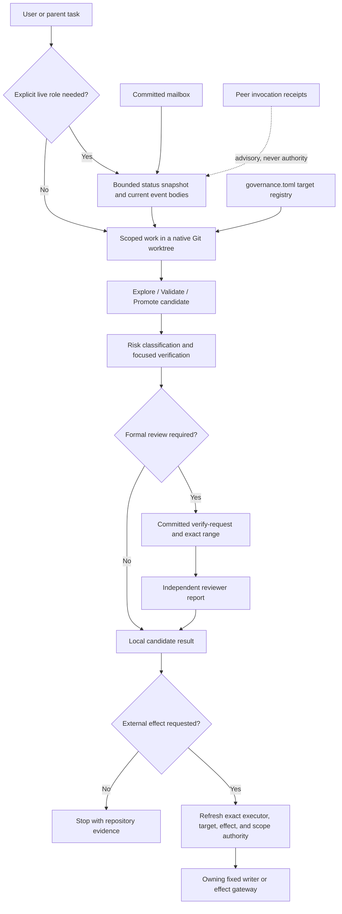

# Pipeline repository manual

> Descriptive map, not an authority source. This manual explains what is in the
> repository and how the pieces connect. `AGENTS.md` is the binding contract,
> `ARCHITECTURE.md` records verified system facts, `docs/GUIDEBOOK.md` walks the
> paths you actually take, and executable code wins when prose drifts. User
> authority, review authority, and external-effect authority are not created by
> this document.

## 1. Identity and intent

Pipeline is a small governance kernel around AI-assisted engineering. It is not
the product being built, an agent scheduler, an AI provider, or a general CI
platform. Its purpose is to keep the minimum durable evidence needed to answer:

- What task and repository were in scope?
- Who, if anyone, held an explicitly assigned role?
- What exact Git range was implemented and reviewed?
- What evidence supports the result?
- Was an external effect separately authorized?

The default registered product target is `evidence-ledger`, but product-local
truth remains in the target repository. Pipeline owns provider-neutral identity,
review, mailbox, peer-invocation, and target-binding mechanics.

The repository has exactly two participants: the `claude` CLI and the `codex`
CLI. Neither is a service the other talks to; each is a program the other can
run once as a child process (`docs/protocol/peer.md`).

The normal path is deliberately smaller than the repository's historical
four-seat vocabulary suggests. Ordinary reversible local work needs a native Git
worktree and focused checks, not a seat ceremony. Formal author/reviewer
artifacts appear only when the actual risk or transfer boundary requires them.
Merge, lock, cursor consumption, peer invocation, paid spend, and live-data
mutation are separate effects even after review succeeds. Push is deliberately
**not** on that list — see `AGENTS.md` item 6 for why a prose obligation with no
enforcing mechanism was dropped rather than left standing as decoration.

Two independent classifications shape a run:

| Question | Closed decision surface | Effect |
|---|---|---|
| What phase is the product work in? | `explore`, `validate`, `promote` in `docs/protocol/work-modes.md` | Controls iteration and candidate freezing. |
| How risky is the change or claim? | `ordinary-local`, `material-behavior`, `high-risk-control`, `external-effect` in `pipeline/codex_protocol_model.py` | Controls evidence, independence, and authority requirements. |

Work mode never grants a role or an effect. A role never grants an external
effect. A passing test proves only the path it executed.

## 2. How this map is derived

The inventory is driven by Git rather than filesystem discovery:

```bash
git rev-parse --show-toplevel
git rev-parse HEAD
git ls-files
git status --short --branch
```

That distinction matters. Large parts of `coordination/` are ignored for new
runtime files but contain intentionally tracked historical evidence, and
untracked scratch (`tests/integration/__pycache__`, `.venv`, worktrees) is not
part of the repository at all. `rg --files` or a plain `find` therefore does not
describe the committed repository faithfully.

Prefer the command over any number printed here. Every count below was measured
at commit `cb931b700ef9bf4af802aea3e31e6f9b72c02d47` and will drift; the command
beside it stays correct.

### 2.1 Census at the measured commit

`git ls-files | wc -l` returned 1,612 tracked paths. By extension
(`git ls-files | sed -n 's/.*\.\([A-Za-z0-9]*\)$/\1/p' | sort | uniq -c | sort -rn`):

| Extension | Count | Principal use |
|---|---:|---|
| `.md` | 1,175 | Active doctrine, mailbox events, handoffs, plans, and evidence. |
| `.json` | 286 | Capacity packets, verification scopes, baselines, logs, and test fixtures. |
| `.py` | 111 | Runtime (37 in `pipeline/`), advisory tools (4), and pytest contracts (70). |
| `.toml` | 11 | Project, target, agent, model-family, and provider configuration. |
| `.txt` | 9 | Locked dependencies, kind registry, cursor compatibility state, and allowlists. |
| `.gitkeep` | 4 | Tracked-empty runtime directories. |
| `.jsonl` | 2 | Append-only claim and learning logs. |
| `.yml` | 1 | The single CI workflow. |
| (none) | 8 | `bin/pipeline` and the seven `coordination/bin/` front doors. |

Top-level distribution
(`git ls-files | awk -F/ '{if (NF==1) print "ROOT"; else print $1}' | sort | uniq -c | sort -rn`):

| Path | Tracked files | What dominates the count |
|---|---:|---|
| `coordination/` | 1,164 | 971 committed event bodies and 158 capacity packets. |
| `docs/` | 160 | 96 historical Superpowers artifacts, 31 handoffs, 23 protocol docs. |
| `logs/` | 109 | 96 capability-experiment files plus acceptance and slope evidence. |
| `tests/` | 73 | 69 unit modules, one conftest, three fixture packs. |
| `pipeline/` | 43 | 38 top-level modules/data files plus five baselines. |
| `.claude/` | 17 | Claude discovery surfaces, read-only advisor definitions, settings. |
| Root files | 15 | Routers, truth/intent docs, dependencies, and configuration. |
| `.agents/` | 12 | Canonical reusable skills. |
| `.codex/` | 9 | Codex agent definitions and the project declaration. |
| `tools/` | 4 | Advisory measurement helpers; not an authority surface. |
| `.github/` | 2 | CI workflow and pull-request template. |
| `.superpowers/` | 2 | Retained historical reports, not live instructions. |
| `bin/`, `config/` | 1 each | The single entry point; the model-family registry. |

### 2.2 Structural and behavioral checks

Structural readability is cheap and is not semantic correctness: every tracked
Python source parses with `ast.parse`, every tracked JSON/JSONL/TOML file parses
with its own parser, and every tracked shell front door passes `bash -n`.

The behavioral checks are two commands, and both must be run fresh rather than
cited from this page:

```bash
bin/pipeline check                                    # governance aggregate
PYTHONDONTWRITEBYTECODE=1 .venv/bin/python -m pytest tests -q -p no:cacheprovider
```

This manual deliberately records **no** frozen pass count. A count here would be
a claim about a tree that has since changed, and the suite is order- and
concurrency-sensitive: a run taken while another session mutates the worktree
reports failures that a re-run of the same modules does not reproduce. Report
what your own run printed, including the command.

### 2.3 What this map does not prove

The census accounts for every tracked path by class, but it does not reinterpret
each of the 971 historical event bodies or 96 historical Superpowers artifacts as
current policy. Their immutability and parseability are checked; their original
claims remain historical evidence.

Local files cannot prove live GitHub branch protection, remote ref policy, a
provider's actual identity, or credential custody. Those require
environment-of-record evidence and exact authority.

### 2.4 Provenance (historical)

The first edition of this manual was prepared during the repository-wide audit
on branch `codex/repository-audit-2026-08-09`, against base commit
`89b212b3d3c152a70c3caba9afb5694c9dda6e3a` (`git cat-file -t` confirms the
commit still resolves). Section 10 preserves that audit's findings as a dated
record. The document has been maintained since; where a section describes
current structure, current Git wins.

## 3. Truth and authority hierarchy

Use the narrowest source that owns the question:

| Need | Source of truth | Important boundary |
|---|---|---|
| Current user intent and effect permission | Current user or accepted parent task | Never inferred from role, schema, or old event. |
| Binding agent contract | `AGENTS.md` | Router and contract, not duplicated doctrine. |
| Current verified system facts | `ARCHITECTURE.md`, checked against code | Executable behavior wins if prose drifts. |
| How to actually do a task | `docs/GUIDEBOOK.md` | Walkthrough; it grants nothing. |
| User-principal product intent | `docs/PROGRAM-MANUAL.md` | Intent, not runtime implementation. |
| Work phase | `docs/protocol/work-modes.md` plus `work_profile_for` | Phase is independent of risk and authority. |
| Risk classification criteria | `docs/protocol/agents/risk-classes.md` | Prose criteria; the executable seam is below. |
| Runtime identity, ownership, review risk, effect shape | `pipeline/codex_protocol_model.py` | Closed executable policy seam. |
| Formal request/report grammar and exact range | `pipeline/compact_pair_loop.py` | A committed binding; authors cannot self-approve. |
| Current governed task state | Current committed route/event bodies and Git state | Newer concrete evidence outranks handoffs and packets. |
| Mailbox publication or cursor mutation | `pipeline/mailbox_writer.py` through fixed wrappers | Editing, staging, committing, and consuming are separate. |
| Reaching the other CLI | `docs/protocol/peer.md` | One-shot child process plus a receipt; not a service. |
| Product behavior | Selected target repository | Pipeline does not own product-local truth. |
| Historical rationale | `DECISIONS.md`, handoffs, packets, logs, transfer docs, and review artifacts | Evidence and provenance, not automatically active instructions. |

## 4. System topology



The committed mailbox is the single durable authority transport. A peer
invocation leaves a receipt in `coordination/peer/`, which records what ran; it
is evidence about a subprocess, never a verdict. Provider launchers and
discovery surfaces are adapters around the same policy; they do not become
independent governance kernels.

## 5. Repository map

### 5.1 Root files

The 15 tracked root paths, in full (`git ls-files | awk -F/ 'NF==1'`):

| Path | Purpose |
|---|---|
| `AGENTS.md` | The binding agent contract: universal contract items, review policy, and effect boundaries. |
| `CLAUDE.md` | Claude-specific router into the same protocol. |
| `README.md` | Purpose, quick start, document map, and verification entrypoints. |
| `ARCHITECTURE.md` | Current verified topology and runtime invariants. |
| `OPERATIONS.md` | Operator commands and troubleshooting. |
| `RUNBOOK-DAILY.md` | Compact recurring operating sequence; subordinate to current code and routes. |
| `DECISIONS.md` | Append-only architectural decision history. Supersede by adding, not rewriting old decisions. |
| `TRANSFER-MANIFEST.md`, `TRANSFER-SETUP.md` | Historical bundle-generation provenance; not a current setup path. |
| `governance.toml` | Declarative kernel and target registry; `[binding].default_target` and `forbidden_roots`. |
| `pyproject.toml` | Package metadata, Python floor (`>=3.11`), pytest paths, and warning policy. |
| `requirements-dev.in` | Direct dependency inputs: governance dependencies plus `pytest` and `hypothesis`. |
| `requirements-dev.txt` | The hash-locked transitive set generated by `pip-compile`, and the only lock file. CI installs it with `--require-hashes`. |
| `.env.example` | Optional external-runner variables only. It excludes role/runtime identity, secrets, and `GIT_INDEX_FILE`. |
| `.gitignore` | Runtime, secret, cache, worktree, learning-index, and provider-local exclusions. Tracked ignored history still exists in Git. |

### 5.2 Hidden provider and host surfaces

| Path | Contents and role |
|---|---|
| `.agents/skills/` | Canonical reusable skills (12 files): role routing and deltas, claim/control probes, regression pins, wave gate, variable isolation, and skill authoring. Skill presence grants no role. |
| `.claude/skills/`, `.claude/agents/` | Claude discovery layer mirroring `.agents/skills/`, plus four read-only advisor definitions. `.claude/settings.json` declares that repository lifecycle hooks are absent by design. |
| `.codex/agents/` | Seven Codex custom-agent definitions plus a README. `.codex/config.toml` is a repository **declaration**, not a runtime control: the Codex CLI reads `$CODEX_HOME/config.toml` instead, and `bin/pipeline preflight` is what fails when an `mcp_servers` table or an approval/sandbox key reappears. |
| `.github/workflows/ci.yml` | The single workflow: `smoke`, a three-version macOS `pytest` matrix, one hermetic Linux pytest leg, an advisory (non-gating) lint job, and a `pull_request_target` admission gate. Detailed in section 7.7. |
| `.github/pull_request_template.md` | Review/evidence prompts for pull requests. |
| `.superpowers/sdd/` | Two retained historical reports. Pipeline does not depend on the Superpowers plugin. |

### 5.3 Runtime, documentation, evidence, and tests

| Path | Contents and lifecycle |
|---|---|
| `bin/pipeline` | The single entry point. See section 6.7. |
| `pipeline/` | 38 top-level executables/data helpers plus `baselines/`, grouped in section 6. |
| `pipeline/baselines/` | Five JSON compatibility inputs; four have live readers and `lane_v_report_v1.json` is retained with none. |
| `config/model-families.toml` | Model ID to provider family. A trust-granting schema input: it feeds `codex_protocol_model.models_are_independent`, which gates high-risk-control review acceptance. Unknown IDs stay family-`None` and can never satisfy a different-family claim. |
| `tools/` | Four advisory measurement helpers — `composes.py` (branch topology by Git, not by confidence), `instrument.py` (refuse a reading whose instrument never checked it read anything), `mailbox_ref.py` (produce `path@sha` refs instead of typing them), `vacuity.py` (prove a control can fail). Advisory: they gate nothing and are not an authority surface. |
| `coordination/README.md`, `coordination/mailbox/kinds.txt` | Coordination layout orientation and the fixed writer's accepted event-kind registry. The kind registry is load-bearing data: 25 names PARSE so history stays readable, while `mailbox_writer.NEW_WRITE_KINDS` admits eight for new writes and `NEW_WRITE_SENDERS` admits two roles. |
| `coordination/bin/` | Seven fixed shell front doors for the interpreter, mailbox, locks, claim probing, and the Codex launcher. |
| `coordination/mailbox/sent/` | 971 committed Markdown event bodies. Append-only operational/history corpus. |
| `coordination/mailbox/seen/` | Six tracked compatibility files for the retired concrete seats. Roles (`author`, `reviewer`) are cursorless; these files remain migration/history compatibility state and grant nothing. |
| `coordination/mailbox/archive/` | Tracked-empty archive slot (`.gitkeep`). |
| `coordination/peer/<task>/NNNN-<peer>.json` | Peer-invocation receipts: what ran, under what argv, with what result. Diagnostic evidence, never task or effect authority. |
| `coordination/capacity/packets/` | 158 JSON campaign/capacity packets from the retired four-seat scheduler. Historical diagnostic evidence; the scheduler itself is gone. |
| `coordination/locks/` | Ephemeral Git-native shared-module locks; empty in the committed tree except for its sentinel. |
| `coordination/presence/` | Legacy/provider liveness guidance and a template. Host activity is authoritative for liveness. |
| `coordination/verification/` | Twelve authority and historical verification-scope records. |
| `coordination/workflows/discovery-bughunt.js` | Reusable historical discovery-bughunt workflow description, not a core Python runtime. |
| `docs/GUIDEBOOK.md` | Task-oriented walkthrough of the paths you actually take, in order. This manual is its reference half. |
| `docs/PROGRAM-MANUAL.md` | Canonical expression of user-principal intent. |
| `docs/protocol/agents/` | Universal role, orchestration, risk-class, and failure doctrine. |
| `docs/protocol/{codex,claude}/` | Host-specific continuation and adoption mechanics. |
| `docs/protocol/peer.md` | The peer-invocation mechanism and each CLI's headless flag map. |
| `docs/protocol/learning/` | Learning-plane contract, skill-use doctrine, slope-metrics doctrine, and dated experiments. |
| `docs/templates/` | Four implementer/reviewer prompt templates retained for explicit use. |
| `docs/superpowers/` | 96 historical briefs, plans, and specs. Inputs and provenance, not current instructions. |
| `docs/HANDOFF-*.md` | 31 durable historical transfer/closeout records. Current Git and events outrank them. |
| `docs/{INCIDENT-LOG,PROTOCOL-RULES-LOG,REMEDIATION-INVENTORY}.md` | Incident history, rule provenance, and campaign inventory. |
| `logs/capability-first/` | 96 files from a bounded capability experiment, including records and evidence snapshots. |
| `logs/claims/`, `logs/learning/` | Append-only claim and learning ledgers. |
| `logs/slope/` | Two dated quality-slope snapshots produced by `bin/pipeline metrics`. |
| Remaining `logs/*.json` and `.md` | Acceptance, performance, consultation, and status evidence. Preserve context and date when citing. |
| `tests/unit/` | 69 modules: fine-grained behavior, negative controls, provider isolation, document integrity, role-cutover, peer-receipt, and property contracts. |
| `tests/learning_packs/`, `tests/skill_packs/` | Recurrence and skill-selection fixtures for learning-plane tests. |
| `tests/conftest.py` | Shared fixtures and two session-wide controls: an autouse fixture that pins `GIT_CEILING_DIRECTORIES` to the scratch basetemp, so git invoked in a non-repository temp directory cannot walk up and answer with the enclosing checkout's state; and a `pytest_sessionfinish` hook that turns a green run with zero executed call reports into a failure when `PIPELINE_REQUIRE_EXECUTED_TEST=1` (CI sets it). |

There is no tracked `tests/integration/`. The directory survives on disk in some
checkouts as an untracked `__pycache__` shell from the deleted ChatGPT-Pro
reservation contract; `git ls-files tests` does not list it.

## 6. Executable inventory: modules and fixed front doors

This section accounts for every top-level file in `pipeline/` and every fixed
shell front door. Re-derive it with `git ls-files pipeline` and
`git ls-files bin coordination/bin`. Files are grouped by the mechanism they
serve; a group does not imply an authority grant.

### 6.1 Policy, orientation, Git projection, and targets

| File | Responsibility |
|---|---|
| `pipeline/codex_protocol_model.py` | Canonical runtime identity, seat outcome, work/review profiles, model-family independence, ownership, and effect-shape policy. |
| `pipeline/cli.py` | Maps one verb (longest prefix wins) onto an existing module's entrypoint with `sys.argv` rewritten, so no option is re-declared and no module loses ownership of its parsing. |
| `pipeline/git_runner.py` | One Git subprocess environment policy, applied per call. `authority_env` is hermetic (fixed `PATH`, C locale, isolated HOME/XDG, no inherited `GIT_*`, no user/system config) for validators and gates; `dashboard_env` is best-effort for read-only surfaces. Both pin repository discovery with `GIT_CEILING_DIRECTORIES`, so a non-repository root answers "not a repository" instead of escaping upward into the enclosing checkout. |
| `pipeline/status.py` | Compact read-only orientation snapshot plus a compatibility dashboard for Git, mailbox unread authority, request state, ADR, docs, manifest, and optional environment status. Only `--write` writes `STATUS.md` (untracked); an absent manifest is `[]` and a collection failure is a typed unavailable reason. |
| `pipeline/git_commit_projection.py` | Pins one repository identity/HEAD and builds a bounded in-memory commit graph for type and ancestry checks. |
| `pipeline/protocol_mailbox.py` | Shared role/seat/kind vocabulary and parsers for ownership, routes, reviews, learning candidates, checkpoints, and dispositions. `ROLES` is `("author", "reviewer")`; the six concrete seats survive as `LEGACY_SEATS` for reading history. |
| `pipeline/mailbox_history.py` | Reads committed mailbox history across two past events: the `scripts/` to `pipeline/` rename, and the commit at which the six seat names stopped being publishable. Neither is a licence to forget — a manifest missing under both prefixes is still a deletion, and a post-cutover event carrying a retired identity is still fatal. The boundary is enforced here against committed bytes, so a hand-authored file plus `git add` cannot go around the writer. |
| `pipeline/route_lineage.py` | Resolves route ancestry and supersession from event contents rather than trusting filenames. |
| `pipeline/bus_unread.py` | Resolves unread against the canonical mailbox order; an invalid cursor is unavailable, never zero. |
| `pipeline/target_binding.py` | Parses `governance.toml`, selects a registered target, expands its local path, and exposes forbidden roots. |
| `pipeline/ledger_start_guard.py` | Pipeline-first preflight for an explicitly selected ledger-routed target/role/wave. |

### 6.2 Peer invocation

| File | Responsibility |
|---|---|
| `pipeline/peer.py` | Runs one peer CLI once under a timeout and commits a receipt of what ran. Two subcommands: `ask` and `receipts`. |
| `pipeline/peer_backends.py` | Builds each peer's argv and reads the model and result from that peer's own output at declared positions only; absence is recorded with a note, never inferred from the request. |
| `pipeline/peer_receipt.py` | The receipt format, with three invariants that were each a real defect first: `--task` must be one safe path component (unconstrained, `../mailbox/sent` escaped the receipts directory), the sequence number comes from the highest present rather than a count (counting reuses a number the moment the sequence has a gap), and the file is created exclusively (a record of something that happened must not be silently replaced). |

### 6.3 Mailbox, review, checkpoint, and claim evidence

| File | Responsibility |
|---|---|
| `pipeline/mailbox_writer.py` | Fixed fail-closed event/cursor candidate validation, writer fencing, atomic finalization, and explicit staging. Both ends of a new event must be live roles (`all` still lawful as a broadcast target). |
| `pipeline/compact_pair_loop.py` | Composes/parses committed verify-requests and verification-reports; binds identities, risk, abuse analysis, repository, paths, ancestry, exact range, and supersession. |
| `pipeline/check_coordination.py` | Lints committed mailbox/cursor/history state and inspects current verify-request/report closure. |
| `pipeline/check_go_schema.py` | Validates frozen historical report bytes and current compact report structure. |
| `pipeline/consume_reviewer_result.py` | Parses `reviewer-result/1`, validates schema, safely reruns cited pytest commands, detects fabrication, and proposes inventory transitions. |
| `pipeline/draft_checkpoint.py` | Drafts ONE long-horizon continuation checkpoint into scratch as a `findings` body carrying the `AGENTS.md` item 7 payload. Drafts only: it never publishes and never mutates Git; the author reads the draft and runs `bin/pipeline mail send` with whatever authority that needs. Its required `Lessons:` line is an anti-forgetting prompt, not a quota — `none-considered` is always valid. |
| `pipeline/claim_check.py` | Derives claim premises from sentence shape and prepares reduced-context challenge probes. |

### 6.4 Provider adapters

| File | Responsibility |
|---|---|
| `pipeline/codex_seat_launcher.py` | Builds one Codex launch spec from per-seat model/tier config, sanitizes inherited state, and rejects forwarded execution-shape overrides. The config is off-repo (`~/.codex/pipeline-seat-launcher.toml` by default) and must define exactly the launchable seats, which are now the two live roles (`author`, `reviewer`), so the command refuses rather than guesses when an operator's file predates the role change. Trusted user/project config still owns effective sandbox/approval posture; the launcher does not attest it. |
| `pipeline/harness_preflight.py` | Reports whether both peer CLIs are on PATH, whether `.codex/config.toml` has regrown an `mcp_servers` table or an `approval_policy`/`sandbox_mode`/`features` key, and what MCP inventory the CLI will really load from the resolved config. Read-only and free: the old `--live` flag, which carried a second hand-rolled argv and spent real money, is gone. A live round trip is peer invocation (section 7.4). |

### 6.5 CI, inventory, and anti-ceremony controls

| File | Responsibility |
|---|---|
| `pipeline/governance_verify_all.py` | Completion bundle for architecture/doc, coordination, no-ceremony, schema, placeholder, and runtime invariants. The single source of truth for the CI smoke job. |
| `pipeline/ci_admission_gate.py` | Classifies a PR range against the active authority-surface list it owns (routers, `pipeline/`, `config/`, `docs/protocol/`, `coordination/bin/`, `.github/workflows/`, agent/skill definitions, conftest, dependency lock) and requires structurally valid committed high-risk Compact Pair evidence when triggered. Declared reviewer fields are not runtime identity attestation. |
| `pipeline/check_doc_claims.py` | Checks line/symbol anchors, manifests, and optional historical commit-SHA citations; can classify reviewed baseline drift. Defaults to `ARCHITECTURE.md`. |
| `pipeline/check_arch_freshness.py` | Rejects substantive `ARCHITECTURE.md` changes without a new resolvable verification stamp. |
| `pipeline/check_no_ceremony.py` | Rejects verification theater and Python changes that grow past a fixed budget: 80 net lines per file, 100 net total, measured from the PR base. |
| `pipeline/check_placeholders.py` | Fail-closed placeholder scan with `pipeline/placeholder_allowlist.txt` as the explicit baseline. |
| `pipeline/wave_gate_check.py` | Selects a campaign wave's strict-xfail pins, runs them under `--runxfail`, checks product oracles, and reports MET/UNMET; an empty wave is UNMET. |
| `pipeline/pin_reconciler.py` | Finds inventory rows marked verified whose pins still behave as xfails. |
| `pipeline/seed_inventory.py` | Enumerates pytest xfail pins into candidate inventory rows; parse or dynamic-metadata ambiguity fails visibly. |
| `pipeline/protocol_doctor.py` | Strict read-only bundle of protocol validation checks. |
| `pipeline/placeholder_allowlist.txt` | Data input to the placeholder checker, not an executable. |
| `pipeline/baselines/*.json` | Five compatibility inputs. `immutable_review_history_exceptions.json`, `lane_v_reports_pre_v3.json`, `retired_review_targets.json`, and `review_history_boundary.json` have live readers in `check_coordination.py`, `check_go_schema.py`, and `governance_verify_all.py`; `lane_v_report_v1.json` is retained with no current reader. |

### 6.6 Learning and measurement plane

| File | Responsibility |
|---|---|
| `pipeline/learning_index.py` | Builds/queries a local rebuildable index from a pinned committed tree; unavailable remains distinct from zero results. |
| `pipeline/learning_extract.py` | Drafts one evidence-triggered learning candidate into scratch; it does not publish or mutate Git. |
| `pipeline/learning_metrics.py` | Reports read-only candidate/disposition/promotion lifecycle metrics and advisory linkage warnings. |
| `pipeline/slope_metrics.py` | Read-only quality-slope reporter: verdicts and first-pass GO rate, fail chains, rework, overclaim vocabulary, deferred-defect pins, and intended-versus-landed divergence, bucketed into time windows from one resolved commit. Advisory by construction — it binds nothing and always exits 0 — so a candidate proposing to add or retire ceremony can cite a measured trend instead of an anecdote. |

### 6.7 Fixed front doors

| Path | Delegates to / effect |
|---|---|
| `bin/pipeline` | The single entry point. Clears `GIT_INDEX_FILE`, resolves the primary checkout's interpreter (including from a linked worktree, which carries no `.venv` of its own), and dispatches a verb. Falls back to `python3` with a loud warning when the venv is absent, so a fresh clone gets "your environment is missing" instead of a fabricated gate failure. |
| `coordination/bin/pipeline-python` | The same interpreter resolution for the modules that have no verb yet (`ledger_start_guard.py`, `wave_gate_check.py`, `pin_reconciler.py`, `seed_inventory.py`). Prefix it with its own `unset GIT_INDEX_FILE` line. |
| `coordination/bin/send-event` | Builds a canonical temporary event in a sanitized environment, invokes Compact Pair validation where required, then delegates final publication/staging to `mailbox_writer.py`. It does not commit. |
| `coordination/bin/consume-events` | Sanitized fixed cursor-writer shim; validates, advances, and stages only the named legacy seat's cursor. Roles are cursorless, so this is compatibility state. |
| `coordination/bin/claim-lock` | Separately authorized remote Git effect: validates identifiers/holder context, refreshes origin, creates and push-races an ignored lock file. |
| `coordination/bin/release-lock` | Separately authorized holder-bound remote Git effect: validates the record, deletes, commits, and pushes the release. |
| `coordination/bin/probe-claim` | Displays derived premises and launches one reduced-context provider challenge; advisory and separately authorized because it launches and spends. |
| `coordination/bin/codex-seat` | Capability-checks Python and invokes `codex_seat_launcher.py`; provider launch is still separately authorized. |

## 7. End-to-end process flows

### 7.1 Ordinary local change

1. If mutation is needed, refresh the task-specific native worktree and recent
   history for relevant paths.
2. Use `rg` to identify definitions, writes, callers, imports, string references,
   and siblings before changing a symbol.
3. Add a failing behavior test when feasible; otherwise retain characterization
   evidence or a truthful test-infeasible reason.
4. Implement the smallest scoped change and run the smallest sufficient fresh
   verification.
5. Classify actual risk. Ordinary reversible work can stop locally. Material or
   high-risk work enters exact-range review.
6. Inspect the exact diff, stage explicit pathspecs, and treat publication,
   merge, and other effects as separate actions.

No role, capacity packet, mailbox event, or delegation is required merely because
a local edit exists.

### 7.2 Explicit role and formal review

1. The user or parent explicitly assigns a role; a helper does not infer one.
   The two live roles are `author` and `reviewer`.
2. The assigned participant runs `bin/pipeline status` and reads each relevant
   committed event body.
3. The author works in the selected native worktree and records focused evidence.
4. When the risk profile requires formal review, the author commits the exact
   candidate and publishes one structurally valid verify-request through
   `bin/pipeline mail send`.
5. The non-author reviewer inspects the actual committed range. A high-risk
   control additionally needs different-model-family independence and explicit
   abuse-class analysis.
6. The reviewer publishes GO, NITS, or FAIL bound to that request/range. A helper
   opinion or green script is advisory, not the formal verdict.
7. Remediation creates a new exact range and lawful supersession/remediation
   binding; it does not rewrite the old report.
8. A successful report still does not authorize an external effect.

### 7.3 Mailbox publication and consumption

Publication follows one path:

```text
caller
  -> bin/pipeline mail send  (coordination/bin/send-event)
  -> sanitized temporary canonical candidate
  -> compact_pair_loop validation for review kinds
  -> mailbox_writer.validate_event_candidate
  -> shared writer fence
  -> durable atomic final path
  -> explicit git add of that path
```

The caller then decides separately whether it has authority to commit. A new
event may name only `author` or `reviewer` as sender, and only those plus `all`
as recipient, and only the eight kinds in `mailbox_writer.NEW_WRITE_KINDS`. The
25 names in `coordination/mailbox/kinds.txt` are what may PARSE, because removing
one would make its historical events unreadable, which is a history rewrite.

Cursor consumption is compatibility state: `bin/pipeline mail consume` accepts
only the four retired concrete pair seats, refuses regression/nonexistent
targets, and stages the cursor. Roles are cursorless.

### 7.4 Reaching the other CLI

Both participants are CLIs, so each reaches the other by running it once:

| From | Command | Boundary |
|---|---|---|
| A Claude session | `pipeline peer ask codex --task <id> --prompt-file <f>` | One child process under a timeout; a receipt lands in `coordination/peer/<task>/`. |
| A Codex session | `pipeline peer ask claude --task <id> --prompt-file <f>` | Symmetric; the flag map for both CLIs is in `docs/protocol/peer.md`. |
| Either | `pipeline peer receipts --task <id>` | Read-only listing of what was actually invoked. |

Measured caveat, recorded rather than smoothed over: at
`cb931b700ef9bf4af802aea3e31e6f9b72c02d47` the `pipeline peer` verb does not
reach either subcommand. `bin/pipeline peer ask` and `bin/pipeline peer
receipts` both exit 2 with `unknown subcommand ... expected one of ` and an
empty list, because `cli.py`'s group check rejects an argument under a group
whose leaf is declared `None` before `_resolve` gets to its `(group, None)`
fallback. The module itself is fine; until the dispatcher is fixed, reach it by
path:

```bash
unset GIT_INDEX_FILE
coordination/bin/pipeline-python pipeline/peer.py ask codex --task <id> --prompt-file <f>
coordination/bin/pipeline-python pipeline/peer.py receipts --task <id>
```

Peer invocation is an external effect (provider launch and paid spend) and needs
its own authority at point of use. AGY is an advisory backend of the same verb,
never a seat, reviewer, or authority source. Formal or durable state still uses
the fixed mailbox path; a receipt records a subprocess, not a verdict.

Adapters may translate model flags, worktree selection, or UI state. They must
not widen the canonical identity/risk/effect contract.

### 7.5 Target-repository work

1. `target_binding.py` loads `governance.toml` and selects the CLI target,
   environment target, or configured default in that order.
2. `ledger_start_guard.py` validates the Pipeline-first route only for work that
   is actually ledger-routed.
3. The current route body identifies the lawful target base or worktree. A normal
   checkout may be stale and must not silently replace it.
4. Pipeline mechanisms govern the work; product code, tests, and domain truth are
   read and changed in the target repository.
5. Target refresh, cross-repository mutation, and commit remain separate effects.

### 7.6 Learning and measurement lifecycle

1. `learning_index.py` builds a local, derived index from a pinned committed
   Pipeline tree. It excludes current task state as authority.
2. Evidence recurrence may trigger `learning_extract.py`, which drafts exactly
   one content-addressed candidate in scratch.
3. Publication, if authorized, creates a typed `learning-candidate` mailbox event
   with immutable sources, applicability, exclusions, base hash, risk, producer,
   and provenance.
4. A non-producer may publish an accepted/declined/expired disposition. The fixed
   writer checks replay, source, duplicate, base-hash, self-approval, and floor
   rules that are actually mechanized.
5. Promotion is an ordinary governed Git change through the Compact Pair; the
   learning record itself grants nothing.
6. `learning_metrics.py` measures the lifecycle and `slope_metrics.py` measures
   execution health over time. Both are rebuildable and advisory.

### 7.7 CI and pull-request admission

`.github/workflows/ci.yml` is the only workflow, and it separates candidate
execution from trusted admission:

- `smoke` runs `pipeline/governance_verify_all.py` on macOS/Python 3.13.
- `pytest` runs the complete `tests` tree on macOS for Python 3.11, 3.12, and
  3.13 with `fail-fast: false`, then `check_no_ceremony.py`.
- `pytest-linux-hermetic` runs the same suite once on `ubuntu-latest` with
  `--basetemp` inside the worktree. It exists for two things the macOS matrix
  cannot show: Unix-FHS assumptions that only bite off-macOS, and proof that the
  Git-discovery ceiling holds when scratch directories sit inside a real
  checkout.
- `lint-advisory` runs `ruff`, `mypy`, and `shellcheck` on `ubuntu-latest` under
  `continue-on-error`, with the linters installed unpinned. Findings are visible;
  none of them block a merge. Promoting one to gating requires a hashed
  `requirements-lint.txt` first.
- `admission-gate` is a distinct `pull_request_target` run. It checks out trusted
  base code, checks out the candidate separately without executing it, imports
  its Git objects into the trusted checkout, validates both SHAs as 40 lowercase
  hex characters, and runs the trusted admission implementation against
  base/head. Its concurrency key cannot cancel the candidate run. When an
  authority surface is touched it requires committed, structurally valid
  high-risk Compact Pair evidence covering the applicable commits — validating
  declared reviewer fields, not the provider that actually ran.

No CI job writes to the repository; the workflow is verification only. Actions
are pinned to full commit SHAs and no checkout persists credentials.

The honest assurance boundary is now narrower than it was, and naming it
precisely matters: there is no coverage reporting, no release/packaging job, no
Windows runner, and lint/type/shell checks exist but are advisory rather than
gating. Linux is covered by one hermetic leg, not by the full matrix.

## 8. Artifact lifecycle: current versus historical

| Class | Examples | How to use it |
|---|---|---|
| Active routing and executable truth | `AGENTS.md`, active continuation docs, `pipeline/`, current tests | Follow the owning seam; correct drift in the same change. |
| Current durable protocol state | Current committed route/task/verify events and exact Git range | Read full bodies and bind to their commit; do not infer from filename alone. |
| Compatibility state | `mailbox/seen`, legacy seat names, legacy formats, frozen report exceptions, transfer-era schemas | Preserve only while readers/tests require it; it grants no new authority. |
| Diagnostic campaign state | Capacity packets, presence hints, handoffs, peer receipts | Use to reconstruct or monitor, never as sole task/effect authority. |
| Historical provenance | `DECISIONS.md`, `docs/superpowers`, transfer docs, protocol reviews, incident/rules logs | Cite with date/commit and supersession context. Do not execute as current instruction. |
| Measured evidence | `logs/`, verification scopes, claim ledger, test output | State the producing command/environment and what it does not prove. |
| Derived local state | `.venv`, provider runtime dirs, learning index, caches, scratch, worktrees, `STATUS.md` | Rebuildable and ignored; never use as shared durable truth. |
| Secret/external state | `.env`, provider credentials, remote settings, `~/.codex/` config | Off-repo; permissions and live configuration require direct inspection. |

## 9. Failure model

The kernel is strongest where uncertainty has an explicit non-success state:

| Failure or ambiguity | Required representation | Owning mechanism |
|---|---|---|
| Malformed/unregistered event | Refuse before final publication | `send-event`, `mailbox_writer.py` |
| New event naming a retired seat on either end | Refuse the write | `mailbox_writer.py` (`NEW_WRITE_SENDERS`/`NEW_WRITE_RECIPIENTS`) |
| Committed event crossing the role cutover with a retired identity | Fatal against committed bytes, not just at the writer | `mailbox_history.py` |
| Invalid cursor, regression, or wrong owner | Refuse consumption | `mailbox_writer.py`, `consume-events` |
| Stale/mismatched request range or repository | Invalid request/report | `compact_pair_loop.py`, `git_commit_projection.py` |
| Declared author self-review or insufficient required model-family independence | Structurally invalid formal evidence | Compact Pair plus risk profile; external identity attestation remains separate |
| Unknown model ID offered as review independence | Family `None`; cannot satisfy a different-family claim | `config/model-families.toml`, `codex_protocol_model.models_are_independent` |
| Missing exact external-effect authority | Stop before effect | Current task/user authority and owning gateway |
| A scratch or non-repository root asked for Git state | "Not a repository", never the enclosing checkout's answer | `git_runner.py` discovery ceiling |
| Lock push returns nonzero and the remote result cannot be inspected | `UNKNOWN`; preserve the local claim/release commit and reconcile before retry | `claim-lock`, `release-lock` |
| Forwarded CLI flag overrides fixed launch identity/workspace/execution shape | Refuse launch | `codex_seat_launcher.py`; ambient trusted config still owns effective posture |
| Launcher config missing a launchable seat (`author`, `reviewer`) | Refuse rather than guess a model/tier | `codex_seat_launcher.py` |
| Peer `--task` that is not one safe path component, or a receipt path that already exists | Refuse; never overwrite a record of something that happened | `peer_receipt.py` |
| Peer produced no readable model or result | Record the absence with a note | `peer_backends.py`; never inferred from the request |
| Empty wave, non-strict/ordinary selector, failed pin, xfailed pin, or missing oracle | UNMET | `wave_gate_check.py` |
| Unparseable/dynamic xfail inventory metadata | Explicit inventory error | `seed_inventory.py` |
| Manifest collection exception | Unavailable with reason, distinct from legitimate absence | `status.py` |
| Doc anchor or Pipeline-local reviewed-SHA baseline drift | Fatal/advisory/baseline result, not silent success; foreign evidence is repository-qualified | `check_doc_claims.py` |
| Python growth past 80 net lines in one file or 100 net total | Hard violation | `check_no_ceremony.py` |
| A collected suite in which every test was skipped | Nonzero exit, never a green all-skipped run | `tests/conftest.py` under `PIPELINE_REQUIRE_EXECUTED_TEST=1` |

The converse is important: not every prose rule is mechanized. Provider labels
are not cryptographic runtime attestation, GitHub branch protection is not proven
by local YAML, and a check that only searches for a source-code string is not a
behavioral control. `AGENTS.md` item 6 records the sharpest instance: an
obligation that existed in five documents and in no mechanism was deleted rather
than left standing.

## 10. Audit findings of 2026-08-09 (historical record)

> Dated record, not current instruction. These findings were reproduced in the
> base of the `codex/repository-audit-2026-08-09` audit. Several mechanisms named
> below — the merge gate, the handoff archiver, the cursor backfill, the signed
> control plane, `system_health_check.py` — have since been deleted outright
> rather than repaired, so the rows describe why they were touched, not code you
> can still run. "Candidate response" described that audit's worktree.

| Finding | Consequence | Candidate response |
|---|---|---|
| ChatGPT Pro integration encoded the retired reservation contract. | Full suite red while focused unit CI stayed green. | Update the integration test to the current content-free reservation/finalization contract. |
| CI ran only `tests/unit`. | Integration drift was invisible to required CI. | Run the full `tests` tree on Python 3.11/3.12/3.13. |
| Lock files are ignored; ordinary `git add` did not reliably stage them. Fetch/merge was best-effort, failure rollback used `reset --hard`, release did not require the holder, and a push accepted before acknowledgement loss was reported as rejected. | A "won" lock could be absent, valid remote state could be misreported, unrelated work could be lost, or another actor could release it. | Force-add the exact lock, validate identifiers/holder, require clean attached/fast-forwardable state, use narrow soft rollback, and inspect the exact remote ref after nonzero transport before returning WON/LOST/UNKNOWN. |
| A cutover backfill failure left newly written signed refs visible; an initial rollback fix could leave legacy cursor files half scalar or overwrite an interleaving writer. Prose also invented a later activation marker that no reader consulted. | Either transport could become partially migrated, another writer's valid update could be lost, or operators could misunderstand when authority actually changed. | Restore exact cursor files and ref chains with CAS, preserve/refuse ref interleaving, and require legacy-cursor quiescence. The signed plane was later removed entirely. |
| Kind- or bus-ID-filtered consumption could advance past unseen events; coordinators were accepted as cursor owners. | Events could be silently skipped and role semantics widened. | Require `--no-advance` for either filter and restrict consumption to the concrete pair seats. |
| Merge gate `--run-once` printed an exception and returned success. | Automation could treat a failed evaluation as healthy. | Return nonzero on a one-shot iteration error. The merge gate was later deleted. |
| Private key loading accepted unsafe names/types/modes; bootstrap overwrote or tolerated partial rosters, silently chmodded an existing empty keystore, and interruption could strand files. | Traversal, disclosure, key replacement, surprise external mutation, or a permanently partial roster. | Enforce exact names/hex/types/modes/roster/separation, exclusive creation, idempotent complete state, interrupt-safe identity-checked rollback, and refuse rather than chmod pre-existing insecure external directories. |
| Public-key verification read mutable working-tree registry bytes while describing them as committed trust. | A dirty or substituted key could authenticate a forged signer. | Bind the registry to a resolved commit and read regular blobs with Git object commands. |
| Codex forwarded arguments appeared after fixed launcher arguments and could override model/cwd/config or switch subcommands; prose also claimed the launcher owned approval posture despite preserving ambient `CODEX_HOME`. | Reported identity could differ from the process, and a non-attested ambient posture could be mistaken for enforcement. | Reject forwarded identity/workspace/execution-shape overrides and escaping subcommands; explicitly leave effective sandbox/approval posture to trusted user/project config. |
| Admission omitted active authority/test-control surfaces and merge-resolution changes; the original PR topology executed candidate gate code, accepted an all-skipped pytest run, and synthetic merge commits could not match pre-head review. | High-risk changes could bypass or permanently block the intended floor. | Protect broad active namespaces with independent probes, reject all-skipped CI, aggregate merge-parent paths, and run trusted-base gate code under `pull_request_target` against separately imported candidate objects. |
| An inventory wave with zero rows could report MET. | Absence of evidence became success. | Emit a `wave has no inventory rows` blocker and UNMET. |
| Anti-ceremony R3 looked for strings rather than exercising the gate, and the wave gate accepted ordinary, disabled, shadowed, or skipped selectors. | An unreachable runner or a non-executed/non-xfail test could satisfy the control. | Run witnessed unresolved/fixed controls through the real gate and use a trusted pytest plugin to require an active, unconditional, literal strict-xfail marker with no skip. |
| Status rendered a manifest exception as if no manifest existed. | Invalid/unavailable state was confused with legitimate absence. | Carry and render a typed unavailable reason. |
| `seed_inventory.py` skipped syntax errors or flattened dynamic xfail metadata, including `**kwargs`. | Inventory could omit or weaken controls while appearing complete. | Fail with path/line context on unreadable sources, nonliteral metadata, or dynamic keyword expansion. |
| Handoff archival fell back from failed `git mv`, rewrote same-day indexes, missed interrupts, accepted typoed `--keep`, and followed tracked archive/index symlinks. | History/staging could diverge, entries could disappear, or output could escape the intended directory. | Use only `git mv`, cumulative atomic no-follow indexes, BaseException rollback, and lstat-reject symlinked components. The handoff drafters and archiver were later deleted. |
| `system_health_check.py` duplicated health paths and always returned zero. | It added a false-green command and maintenance surface. | Delete it and its tests; keep the owning checks. |
| Active doctrine and provider copies repeated retired four-seat ceremony, index rules, and blanket model-independence. | Agents could follow stale prose over current risk-based executable behavior. | Reduce provider copies to adapters, remove retired duplicates, and align active doctrine with explicit roles, native worktrees, and risk-gated independence. |

## 11. Remaining refactor and capability queue

The following are evidence-backed opportunities, not new mandatory process:

1. **Split the largest mixed-responsibility functions.**
   `check_coordination.inspect_verify_review_state`, its committed-mailbox
   projection, `governance_verify_all.main`, and
   `mailbox_writer._send_event_finalize` combine parsing, policy, I/O, and
   presentation. Extract pure typed projections first, then keep one thin I/O
   shell. This would make failure injection and property testing cheaper without
   creating a new framework.

2. **Centralize effect/destination classification without centralizing all
   execution.** Protected paths/refs and authority surfaces are repeated across
   the launcher, the admission gate, and the writer. A small deterministic
   classifier with provider adapters would reduce drift; fixed writers should
   remain separate effect executors.

3. **Make repository documentation inventory self-checking.** Nothing guards this
   file, so it drifts silently between audits. A read-only generated census
   command could validate that every tracked path belongs to a documented class
   without regenerating policy or failing on harmless count changes — the same
   drift-proofing `tests/unit/test_protocol_doc_integrity.py` already applies to
   the pull-request template.

4. **Keep active-versus-historical cleanup continuous.** Preserve historical
   bytes where they are evidence, but avoid new operational links into them and
   delete only after live-call-path proof.

5. **Give every module a verb, or say why not.** `bin/pipeline` covers most of
   `pipeline/`, but `ledger_start_guard.py`, `wave_gate_check.py`,
   `pin_reconciler.py`, and `seed_inventory.py` are still reached by path through
   `coordination/bin/pipeline-python`. Either route them or record that they are
   campaign-only.

6. **Add deterministic failure scenarios at the owning seams.** A small
   injectable runner/refstore fixture can cover writer crash points, CAS
   contention, and lock push rejection. Reuse existing fakes and temporary Git
   repositories rather than adding a service simulator.

7. **Broaden environment evidence proportionately.** CI covers macOS for three
   Python versions and Linux for one hermetic leg; lint, type, and shell checks
   run advisory-only, and there is no coverage, packaging, or Windows job.
   Promote lint to gating only behind a hashed `requirements-lint.txt`; add
   other jobs only when a supported runtime or recurring defect justifies them.

8. **Retire dormant commands only after call-path proof.** `lane_v_report_v1.json`
   has no reader, and some campaign tooling has only historical call paths.
   Search definitions, imports, shell/docs references, and tests; delete or
   narrow them only when no supported workflow depends on them. Do not preserve
   a command merely because it sounds protective.

9. **Reduce historical search cost without rewriting evidence.** The tracked
   mailbox, packets, handoffs, Superpowers corpus, and logs dominate file count.
   Keep their bytes immutable, but prefer committed indexes/projections for
   normal orientation so agents do not repeatedly ingest the corpus.

10. **Measure controls through call-path mutation.** Continue replacing static
    source-marker checks with a known-positive, a bypass/evasion negative, and a
    deleted-call-path mutation; `tools/vacuity.py` exists to make that routine.
    Do this only for controls whose failure would change a decision.

11. **Expose truthful capability states.** Provider reachability, process
    launch, model selection, runtime health, and readiness are distinct. Keep
    `unavailable`, `unknown`, `pending`, `rejected`, and `blocked` separate from
    false and zero throughout status output and adapters.

12. **Verify external repository settings.** Full-SHA GitHub Actions pins are
    present, but local files cannot prove required reviews, protected `main`,
    secret access, or workflow environment restrictions. Capture those from the
    host only when a promotion claim needs them.

## 12. External research cross-check

The 2026-08-09 audit used external sources as design checks, not as substitutes
for local call-path proof:

- GitHub's secure-use guidance recommends pinning third-party actions to full
  commit SHAs. Pipeline's workflow does this, but repository YAML still cannot
  prove live branch/secret settings: [GitHub Actions secure use](https://docs.github.com/en/actions/reference/security/secure-use?learn=getting_started&learnProduct=actions).
- SLSA 1.2 separates source controls, provenance, and artifact verification.
  Pipeline has local exact-range/evidence primitives, while protected-source and
  deployment provenance remain environment-of-record gaps:
  [SLSA 1.2](https://slsa.dev/spec/v1.2/),
  [source requirements](https://slsa.dev/spec/v1.2/source-requirements), and
  [verifying artifacts](https://slsa.dev/spec/v1.2/verifying-artifacts).
- NIST AI RMF organizes risk work around Govern, Map, Measure, and Manage.
  Pipeline is a governance/engineering harness, not a complete organizational
  AI-risk program: [NIST AI RMF](https://www.nist.gov/itl/ai-risk-management-framework)
  and [core functions](https://airc.nist.gov/airmf-resources/airmf/5-sec-core/).
- OpenAI's harness-engineering guidance emphasizes repository legibility,
  feedback loops, and reliable tools around agents. Pipeline's durable events,
  exact ranges, tests, and provider-neutral adapters align with that direction;
  the refactor queue targets the remaining context and ceremony cost:
  [Harness engineering](https://openai.com/index/harness-engineering/) and
  [building agents](https://openai.com/business/guides-and-resources/a-practical-guide-to-building-ai-agents/).

Dependency review is a complementary supply-chain control that evaluates
dependency changes in pull requests; hash locking alone does not provide that
change review: [GitHub dependency review](https://docs.github.com/en/code-security/concepts/supply-chain-security/dependency-review).

## 13. Operator command map

These commands are read-only unless the row says otherwise. `bin/pipeline`
clears `GIT_INDEX_FILE` and resolves the repository interpreter itself, so no
`env -u` prefix or venv path is needed in front of a verb. `bin/pipeline --help`
prints the current verb list, which is the authority when this table drifts.

| Need | Command | Effect boundary |
|---|---|---|
| Confirm repository and state | `git rev-parse --show-toplevel && git status --short --branch` | Read-only. |
| Compact orientation | `bin/pipeline status` | Read-only snapshot. |
| One seat's live unread count | `bin/pipeline status mailbox-unread director` | Read-only; legacy seat cursors only. |
| Validate target registry | `bin/pipeline target --check` | Read-only. |
| Full governance aggregate | `bin/pipeline check` | The completion gate; runs local checks including pytest-backed controls. |
| Coordination lint | `bin/pipeline check coordination` | Read-only. |
| Doc-anchor drift | `bin/pipeline check docs` | Read-only. |
| Historical SHA citations | `bin/pipeline check docs --sha-refs` | Read-only Pipeline-local validation; references to another repository must be repository-qualified. |
| Anti-ceremony and growth budget | `bin/pipeline check ceremony` | Runs local controls, including pytest. |
| Placeholder scan | `bin/pipeline check placeholders` | Read-only. |
| Frozen and current report bytes | `bin/pipeline check reports` | Read-only. |
| `ARCHITECTURE.md` provenance | `bin/pipeline check arch` | Read-only; inert unless `ARCHITECTURE.md` changed. |
| Admission for a range | `bin/pipeline check admission --base <sha> --head <sha>` | Read-only classification; it attests declared fields, not runtime identity. |
| Protocol validation bundle | `bin/pipeline doctor` | Read-only. |
| Peer CLI capability preflight | `bin/pipeline preflight` | Read-only; launches nothing and spends nothing. |
| Draft a continuity checkpoint | `bin/pipeline checkpoint --help` | Draft into scratch only; publication is separate. |
| Derive a claim's premises | `bin/pipeline claim premises "<claim>"` | Read-only. |
| Execution-health slope | `bin/pipeline metrics` | Read-only; advisory, always exits 0. |
| Learning lifecycle metrics | `bin/pipeline learn metrics` | Read-only. |
| Full tests | `PYTHONDONTWRITEBYTECODE=1 .venv/bin/python -m pytest tests -q -p no:cacheprovider` | Local execution only. |
| Ledger-routed preflight | `unset GIT_INDEX_FILE; coordination/bin/pipeline-python pipeline/ledger_start_guard.py --seat author --wave 2` | Read-only guard; does not grant target mutation. No verb yet. |
| Publish an event | `bin/pipeline mail send <from> <to> <kind> <subject>` (body on stdin) | Writes and stages one event; sender and recipient must be live roles; never commits. |
| Advance a legacy seat cursor | `bin/pipeline mail consume <seat> --repo-root <path>` | Writes/stages cursor; separately authorized; compatibility state only. |
| Invoke the other CLI once | `coordination/bin/pipeline-python pipeline/peer.py ask <claude\|codex\|agy> --task <id> --prompt-file <f>` | External effect: provider launch and paid spend, separately authorized. The `bin/pipeline peer ask` verb is currently broken (section 7.4); `--dry-run` builds the argv without launching. |
| List peer receipts | `coordination/bin/pipeline-python pipeline/peer.py receipts --task <id>` | Read-only; same dispatcher caveat. |
| Reduced-context claim challenge | `bin/pipeline probe "<claim>"` | Launches a provider and spends; separately authorized. |
| Claim or release a shared lock | `bin/pipeline lock claim <wave> <module> <seat> <defect-id>` / `bin/pipeline lock release ...` | Remote Git effect; separately authorized. |
| Dry-run a Codex launch spec | `coordination/bin/codex-seat --dry-run <seat>` | Seat is `author` or `reviewer`. Needs an off-repo `~/.codex/pipeline-seat-launcher.toml` defining exactly those two; it refuses rather than guessing. Launch remains separately authorized. |

For a file-by-file inventory at any later commit, use `git ls-files`, not this
manual's measured counts. For behavior, trace the owning symbol and its tests; do
not promote a descriptive table into an independent policy layer.
