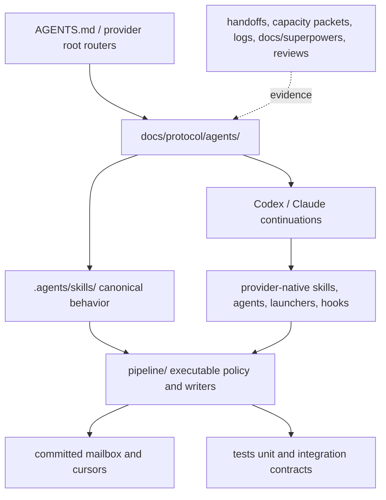

# Protocol Assembly Map

This is a descriptive placement map, not another authority layer. Put each
fact in the lowest surface that actually owns it and link instead of copying.



| Concern | Owning surface | Notes |
|---|---|---|
| Repository router and tier selection | `AGENTS.md` | Keep short; route to scoped truth. |
| Universal role/authority/review policy | `docs/protocol/agents/` | Shared across providers. |
| Work phase | `docs/protocol/work-modes.md` | Independent from review risk and authority. |
| Codex mechanics | `docs/protocol/codex/continuation.md`, `.codex/agents/` | Host task tools and native worktrees; evidence-ledger routes through `docs/protocol/codex/ledger-cli-adoption.md`. |
| Claude mechanics | `docs/protocol/claude/`, `.claude/` | No lifecycle hook or startup binding. |
| Canonical reusable skills | `.agents/skills/` | Provider copies are discovery/adaptation layers. |
| Identity, ownership, risk, effects | `pipeline/codex_protocol_model.py` | Executable policy seam. |
| Formal exact-range review | `pipeline/compact_pair_loop.py` | Request/report grammar and binding. |
| Event/cursor mutation | `pipeline/mailbox_writer.py`, fronted by `bin/pipeline mail send` / `mail consume` (`coordination/bin/send-event`, `consume-events`) | Validated serialized write sites; commit/effect remains separate. |
| Current orientation | `bin/pipeline status snapshot` | Projection only, not authority. |
| Mailbox events | `coordination/mailbox/sent/` | The only coordination transport. New events carry `author` or `reviewer`; the six seat names parse read-only. |
| Mailbox cursors | `coordination/mailbox/seen/` | Compatibility read state for the four legacy pair seats; both live roles are cursorless. |
| Reaching the other CLI | `docs/protocol/peer.md`, `pipeline/peer.py`, `coordination/peer/` | One-shot child process plus a receipt. Evidence, not attestation; never a verdict. |
| Shared-file locks | `coordination/locks/`, `coordination/bin/{claim-lock,release-lock}` | Temporary, holder-bound, separately authorized remote effect. |
| Learning lifecycle | `docs/protocol/learning/contract.md`, `pipeline/learning_*` | Advisory projection/candidates; governed promotion. |
| Product target binding | `pipeline/target_binding.py`, provider target bridge | Pipeline owns governance; target repo owns product truth. |
| Executable checks | `pipeline/` | A green check proves only its call path. |
| Contract tests | `tests/` | CI runs unit and integration suites. |
| Historical provenance | `DECISIONS.md`, handoffs, capacity packets, `logs/`, `docs/superpowers/` | Preserve; do not treat as current instruction. |

## Placement check

```text
Universal rule?             -> docs/protocol/agents/
Provider-only mechanic?     -> docs/protocol/<provider>/ and its native adapter
Reusable behavior?          -> .agents/skills/
Identity/risk/effect rule?  -> pipeline/codex_protocol_model.py
Formal review grammar?      -> pipeline/compact_pair_loop.py
Event/cursor write?         -> pipeline/mailbox_writer.py + fixed wrapper
Reach the other CLI?        -> pipeline peer ask (docs/protocol/peer.md)
Current protocol event?     -> coordination/mailbox/sent/
Target-local product fact?  -> target repository
Executable proof?           -> pipeline/ and tests/
Historical evidence?        -> existing provenance corpus, clearly labeled
```

Do not place current work in `docs/superpowers/`; those files are historical
inputs. Do not centralize all policy here or add a second mutable coordination
truth.
