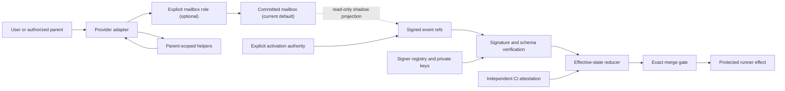

# Threeway Topology

Seats are provider-neutral addresses, not permanent provider assignments.
Helpers do not become roles. Mailbox roles do not become signed principals.
The dotted migration edge becomes authoritative when one separately authorized
cutover creates the coherent refs consumed by readers. There is no later marker;
protected deployment still requires direct post-action proof.
